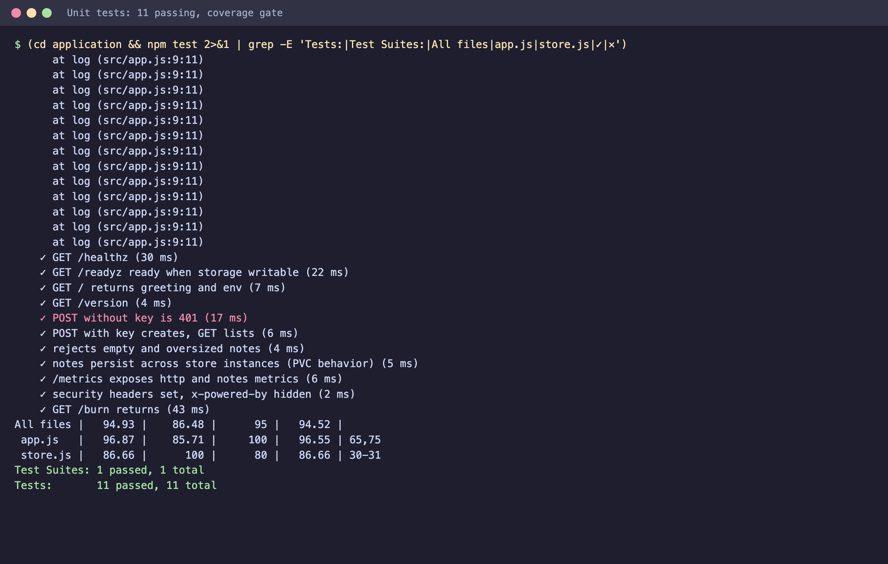
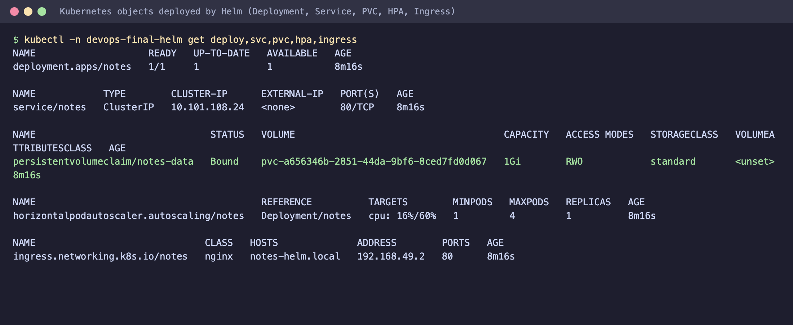
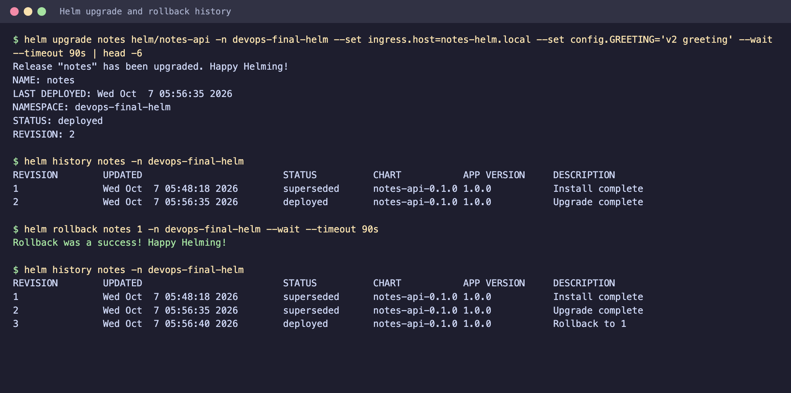
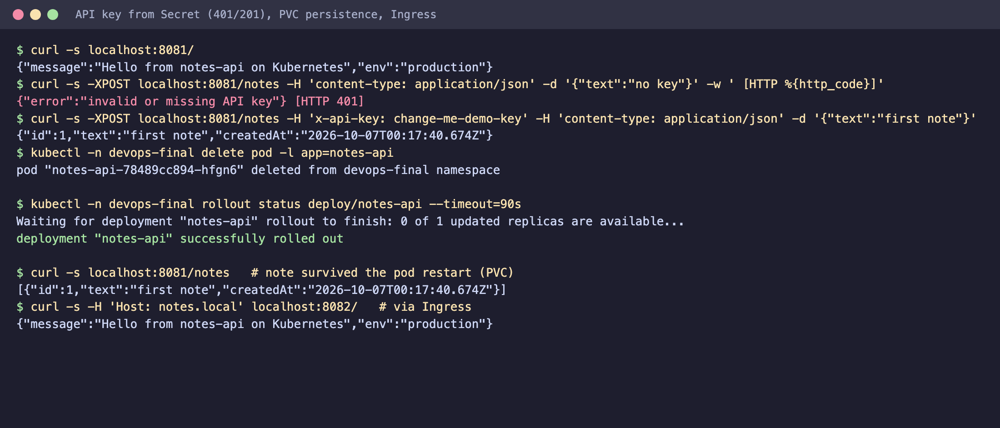
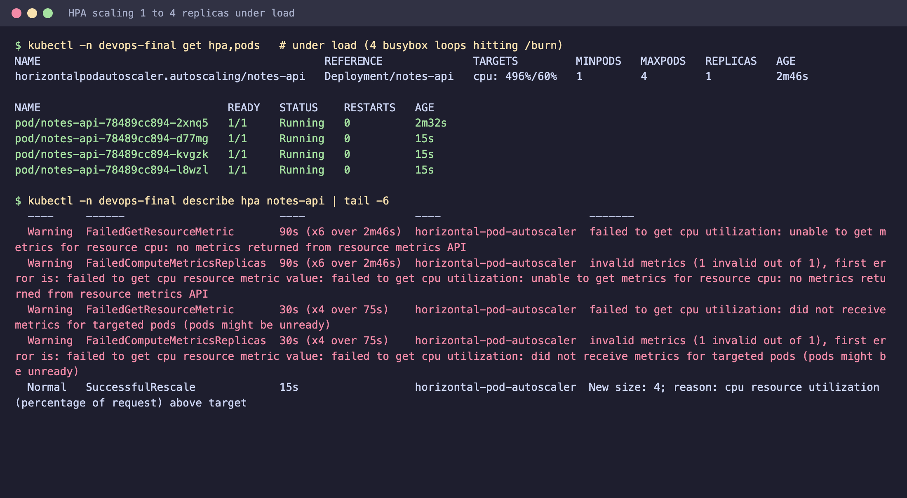
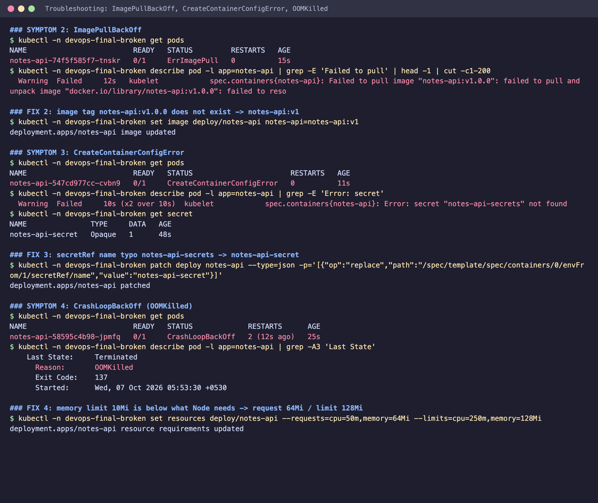
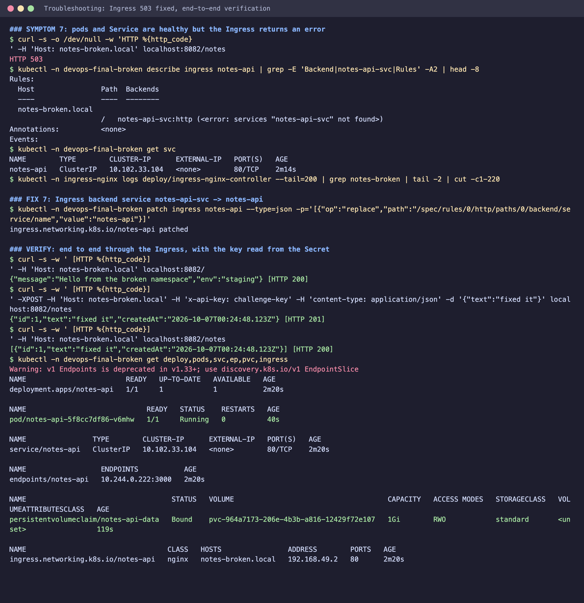

# Final DevOps Project: notes-api, end to end

A small Node.js service taken through the whole DevOps lifecycle: Git -> GitHub Actions CI -> DevSecOps scanning
-> Docker -> registry -> Kubernetes -> Helm -> monitoring -> GitOps, on infrastructure defined with Terraform, plus a
hands-on troubleshooting challenge.

## 1. Project overview

**notes-api** is a REST service that stores short notes. It is deliberately simple so the platform around it is the focus:

| Endpoint | Purpose |
|---|---|
| `GET /` | greeting + environment (from ConfigMap) |
| `GET/POST /notes` | list / create notes; `POST` needs header `x-api-key` (from a Secret) |
| `GET /healthz` | liveness probe |
| `GET /readyz` | readiness probe (is the storage volume writable?) |
| `GET /metrics` | Prometheus metrics (request rate/latency, notes count, CPU, memory) |
| `GET /burn?ms=` | CPU burner to demonstrate the HPA |

Notes are stored on a PersistentVolume, so they survive pod restarts. Logs are JSON on stdout.

## 2. Architecture

```
 Developer -> git push -> GitHub
                             |
                  GitHub Actions (ci-cd.yml)
   build -> unit test -> SAST -> SCA -> secret scan -> IaC scan -> docker build -> image scan
                             |
                       [ SECURITY GATE ]  (any failure stops here)
                             |
                  push image :<sha> to GHCR
                             |
          CI commits new tag to gitops/environments/prod/values.yaml
                             |
 Git (single source of truth) <--- pulls --- Argo CD (in cluster) --- reconciles --->  Kubernetes (EKS)
                                                                                         |
     Terraform -> VPC, EKS, ECR, EBS CSI                              +------------------+--------------------+
                                                                      | Ingress -> Service -> Deployment (Pods) |
                                                                      |   ConfigMap  Secret  PVC  HPA  Probes   |
                                                                      +-----------------------------------------+
                                                                         ^ scrape /metrics      ^ pod logs
                                                              Prometheus + Alertmanager + Grafana   Promtail -> Loki
```

## 3. Technologies

| Area | Tool |
|---|---|
| App | Node.js 22, Express, helmet, prom-client, Jest + Supertest |
| Containers | Docker (multi-stage, non-root), GHCR (ECR also provisioned) |
| Orchestration | Kubernetes (Deployment, Service, ConfigMap, Secret, Ingress, HPA, PVC, probes), Kustomize, Helm |
| IaC | Terraform (AWS: VPC, EKS, ECR, EBS CSI) |
| CI/CD | GitHub Actions |
| Security | Semgrep (SAST), npm audit + Trivy (SCA), Gitleaks (secrets), Trivy (IaC + image) |
| Monitoring | Prometheus, Alertmanager, Grafana, Loki + Promtail, kube-prometheus-stack |
| GitOps | Argo CD (app-of-apps) |

## Repository layout

```
final-devops-project/
├── application/          source, tests, build script
├── docker/               Dockerfile, docker-compose.yml
├── kubernetes/           plain manifests (Kustomize)
├── helm/notes-api/       Helm chart
├── terraform/            AWS infrastructure
├── .github/workflows/    ci-cd.yml
├── security/             scanner configs and policy
├── monitoring/           Prometheus stack values, alerts, dashboard, Loki
├── gitops/               Argo CD apps + per-environment values
├── troubleshooting/      broken deployment + student guide + answer key
└── docs/                 captured command output (evidence)
```

## 4. Application setup

```bash
cd application
npm ci
npm run build      # syntax check + build-info.json
npm test           # 11 tests, coverage gate 80%
DATA_DIR=./data API_KEY=dev-key npm start
curl localhost:3000/healthz
curl -XPOST localhost:3000/notes -H 'x-api-key: dev-key' -H 'content-type: application/json' -d '{"text":"hello"}'
```
Configuration is by environment variable: `PORT`, `DATA_DIR`, `APP_ENV`, `GREETING`, `MAX_NOTE_LENGTH`, `API_KEY`.

## 5. Docker setup

```bash
docker build -f docker/Dockerfile --build-arg GIT_SHA=$(git rev-parse --short HEAD) -t notes-api:v1 application/
docker run -p 3000:3000 -e API_KEY=k notes-api:v1
# or hardened local run with a volume:
docker compose -f docker/docker-compose.yml up --build
```
Multi-stage build (deps/build stage, minimal runtime), runs as the `node` user, has a `HEALTHCHECK`, and `/data` is a volume.
Compose also uses a read-only root filesystem and drops all capabilities. Image size: 247 MB.

## 6. Kubernetes deployment

```bash
# minikube: enable what the manifests need
minikube addons enable ingress && minikube addons enable metrics-server
docker build -f docker/Dockerfile -t notes-api:v1 application/ && minikube image load notes-api:v1
kubectl apply -k kubernetes
kubectl -n devops-final get all,pvc,ingress,hpa
```

| Object | File | Purpose |
|---|---|---|
| Namespace | `namespace.yaml` | isolated, Pod Security `restricted` |
| ConfigMap | `configmap.yaml` | non-secret settings via `envFrom` |
| Secret | `secret.yaml` | `API_KEY` via `envFrom` (demo value; see security notes) |
| PVC | `pvc.yaml` | 1Gi volume mounted at `/data` |
| Deployment | `deployment.yaml` | non-root, read-only rootfs, limits, **startup + liveness + readiness probes**; `Recreate` strategy because the volume is ReadWriteOnce |
| Service | `service.yaml` | ClusterIP :80 -> pod :3000 |
| Ingress | `ingress.yaml` | `notes.local` -> Service (nginx) |
| HPA | `hpa.yaml` | 1-4 replicas at 60% CPU |

Access: `kubectl -n ingress-nginx port-forward svc/ingress-nginx-controller 8082:80` then `curl -H 'Host: notes.local' localhost:8082/`.

**Verified on minikube** (output in [docs/evidence-kubernetes.txt](docs/evidence-kubernetes.txt), [docs/evidence-hpa.txt](docs/evidence-hpa.txt)):
- `POST /notes` without the key returned `401`; with the Secret's key returned `201`.
- After deleting the pod, `GET /notes` still returned the note (PVC persistence).
- The Ingress route served the app.
- Under load the HPA reported `cpu: 496%/60%` and scaled 1 -> 4 replicas.

## 7. Helm deployment

The chart in [helm/notes-api](helm/notes-api) templates all of the above (Secret optional, PVC optional, ServiceMonitor optional).

```bash
helm lint helm/notes-api
helm upgrade --install notes helm/notes-api -n devops-final --create-namespace \
  --set image.repository=notes-api --set image.tag=v1 \
  --set secret.apiKey="$(openssl rand -hex 16)" --wait
helm upgrade notes helm/notes-api -n devops-final --set config.GREETING="v2" --wait   # config change rolls pods (checksum annotation)
helm history notes -n devops-final
helm rollback notes 1 -n devops-final
```
**Verified**: lint passes; install, upgrade (revision 2) and rollback (revision 3 = rollback to 1) all succeeded
([docs/evidence-helm-and-tests.txt](docs/evidence-helm-and-tests.txt)). Production values live in
[gitops/environments/prod/values.yaml](gitops/environments/prod/values.yaml).

## 8. Terraform infrastructure

[terraform/](terraform): VPC (2 AZs, public/private subnets, NAT), EKS with managed node group, ECR (scan on push,
immutable tags, lifecycle policy), EBS CSI driver (for PVCs). Uses implicit dependencies (EKS takes `module.vpc` outputs),
variables with defaults, outputs including a ready-to-run `aws eks update-kubeconfig` command.

```bash
cd terraform && terraform init && terraform validate && terraform plan -out=tfplan && terraform apply tfplan
terraform destroy   # EKS and NAT cost money
```
**Not executed**: no Terraform or AWS access was available, so this is unvalidated. Run `terraform validate` first.

## 9. CI/CD pipeline

[.github/workflows/ci-cd.yml](.github/workflows/ci-cd.yml):

```
build -> unit-test -> sast -> sca -> secret-scan -> iac-scan -> docker-build -> image-scan
      -> security-gate -> push-image (main only) -> update-gitops (Argo CD deploys)
                                                 \-> deploy-helm (manual, optional direct deploy)
```
- The image is built once, saved as an artifact, scanned, and **the same image** is pushed (tag = commit SHA, never `latest`).
- PRs run everything through the gate; push and deploy only happen on `main`.
- `update-gitops` commits the new tag to Git; the commit path is excluded from the trigger so it doesn't loop.
- Required secrets: none for GHCR (uses `GITHUB_TOKEN`); `KUBE_CONFIG_B64` and `NOTES_API_KEY` only for the manual direct deploy.

## 10. DevSecOps implementation

See [security/README.md](security/README.md).

| Stage | Tool | Gate |
|---|---|---|
| SAST | Semgrep with JS/Node/OWASP packs + custom rules | any finding |
| SCA | `npm audit`, Trivy fs | HIGH/CRITICAL |
| Secret scan | Gitleaks, full history | any secret |
| IaC scan | Trivy config (Terraform, Helm, manifests, Dockerfile) | HIGH/CRITICAL |
| Image scan | Trivy | fixable HIGH/CRITICAL |
| **Security gate** | one job requiring all of the above to be `success` | blocks push + deploy |

Runtime: non-root, read-only rootfs, dropped capabilities, seccomp, restricted Pod Security, no service-account token, limits, Secret for the key.
**Status**: the scanners are configured in the workflow but were not run here (no GitHub runner; Semgrep, Trivy and Gitleaks not installed locally).
Expect to triage first-run findings (for example IaC findings on `kubernetes/secret.yaml` or missing NetworkPolicies).

## 11. Monitoring

[monitoring/](monitoring): `kube-prometheus-stack-values.yaml` (Prometheus, Alertmanager, Grafana, exporters), `loki-values.yaml`
(Loki + Promtail DaemonSet for pod logs), `rules/notes-api-alerts.yaml` (down, 5xx rate, p95 latency, pod restarts, memory near limit, HPA maxed out),
and `dashboards/notes-api.json` (request rate, latency, CPU, memory, replicas, notes count, restarts, logs).

```bash
helm repo add prometheus-community https://prometheus-community.github.io/helm-charts && helm repo add grafana https://grafana.github.io/helm-charts
helm install monitoring prometheus-community/kube-prometheus-stack -n monitoring --create-namespace -f monitoring/kube-prometheus-stack-values.yaml
helm install loki grafana/loki-stack -n monitoring -f monitoring/loki-values.yaml
kubectl apply -f monitoring/rules/
helm upgrade notes helm/notes-api -n devops-final --reuse-values --set metrics.serviceMonitor.enabled=true
kubectl -n monitoring port-forward svc/monitoring-grafana 3001:80
```
**Status**: the app's `/metrics` endpoint and the probes were verified, and `kubectl top`/HPA metrics worked on minikube.
The Prometheus/Loki stack itself was **not** installed on the local cluster (it needs more memory than the 4 GB Docker VM had free),
so the values, alert rules, dashboard and ServiceMonitor are unvalidated against a live Prometheus. A previously tested
Docker Compose version of this stack (Prometheus + Alertmanager + Grafana + Loki, with alerts confirmed firing) is in `../../MOGitOps/01-monitoring`.

## 12. GitOps

[gitops/](gitops): Argo CD **app of apps**.
```bash
kubectl create ns argocd && kubectl apply -n argocd -f https://raw.githubusercontent.com/argoproj/argo-cd/stable/manifests/install.yaml
# edit repoURL (YOUR_USER) in gitops/argocd/*.yaml, then:
kubectl apply -f gitops/argocd/project.yaml -f gitops/argocd/root-app.yaml
```
The root app creates `notes-api` (Helm chart + `gitops/environments/prod/values.yaml`), `monitoring` (kube-prometheus-stack) and
`monitoring-extras` (alert rules + dashboard). All have `automated.prune` and `selfHeal`.
Flow: merge code -> CI builds/scans/pushes -> CI commits `image.tag` -> Argo CD syncs. Rollback = `git revert`. Drift (`kubectl edit`) is reverted.
The Secret is intentionally not in Git (`secret.create: false`, uses an existing Secret created out of band or by External Secrets).
`helm template` of the production values rendered correctly; Argo CD itself was not installed here.

## 13. Troubleshooting

[troubleshooting/](troubleshooting) contains a deliberately broken deployment ([broken/app.yaml](troubleshooting/broken/app.yaml)),
a [student guide](troubleshooting/README.md) (identify -> investigate -> root cause -> fix -> verify -> document) and an
[answer key](troubleshooting/SOLUTIONS.md). I ran the full exercise on minikube; the log is [docs/evidence-troubleshooting.txt](docs/evidence-troubleshooting.txt).

| # | Symptom seen | Root cause | Fix |
|---|---|---|---|
| 1 | Pod `Pending`, PVC `Pending` | StorageClass `fast-ssd` doesn't exist | recreate PVC with `standard` |
| 2 | `ErrImagePull` | image tag `v1.0.0` doesn't exist | use `v1` |
| 3 | `CreateContainerConfigError` | `secretRef` typo (`notes-api-secrets`) | correct the name |
| 4 | `CrashLoopBackOff`, `OOMKilled` (137) | memory limit 10Mi | 64Mi request / 128Mi limit |
| 5 | `Running` but `0/1` Ready | readiness path `/ready` returns 404 (app has `/readyz`) | fix the path |
| 6 | Pod Ready, endpoints `<none>` | Service selector `notes-app` != pod label `notes-api` | fix the selector |
| 7 | Ingress returns 503 | backend Service `notes-api-svc` doesn't exist | point at `notes-api` |

Final check passed: `GET /` returned 200 through the Ingress, `POST /notes` with the Secret's key returned 201, and `GET /notes` returned the note.
Method used every time: `kubectl get` (symptom) -> `describe`/events (evidence) -> compare the referencing field with the referenced object (root cause)
-> smallest patch -> a command that proves it. Follow the request path backwards: Ingress -> Service -> Endpoints -> Pod -> Container -> Storage.

## 14. Screenshots

These are terminal-style images **rendered from the real command output I captured** while running the project on minikube
(not live window captures). The raw text is in [docs/](docs/).

| | |
|---|---|
|  | 1. Unit tests: 11 passing, coverage above the 80% gate |
|  | 2. Deployment, Service, PVC, HPA, Ingress, ConfigMap, Secret created by Helm |
|  | 3. Helm upgrade (rev 2) and rollback (rev 3) history |
|  | 4. 401 without key, 201 with Secret key, note survives pod deletion, Ingress works |
|  | 5. HPA scales 1 to 4 replicas under load (cpu 496%/60%) |
|  | 6. Troubleshooting: ImagePullBackOff, CreateContainerConfigError, OOMKilled |
|  | 7. Ingress 503 diagnosed and fixed; end-to-end 200/201 verification |

Still to capture yourself where the parts were not run here: GitHub Actions run with the security gate, Argo CD synced app tree,
Grafana `notes-api` dashboard, `terraform plan` summary.

## 15. Lessons learned

1. **Faults hide behind each other.** Seven faults needed seven passes; always follow the request path and read `describe` events before guessing.
2. **Most outages are reference mismatches**: a name, label, port or path that differs by a character between two objects. Generating names/labels from one Helm helper removes a whole class of them.
3. **Resource limits are real.** 10Mi OOM-killed the container (exit 137); 20Mi did not. Size limits from measurements, and alert on restarts and memory vs limit.
4. **Probes are contracts.** Wrong readiness path = running but never receiving traffic; liveness and readiness must differ in meaning.
5. **Metrics-server needs time**: the HPA showed `<unknown>` for the first couple of minutes and warned about "unready pods"; it scaled to 4 once metrics flowed.
6. **PVC specs are immutable** and `ReadWriteOnce` + a rolling update can deadlock, so the Deployment uses `Recreate`.
7. **Ingress hosts must be unique across namespaces** (the nginx admission webhook rejected a duplicate `notes.local`).
8. **Design limitation found by the HPA test**: the file-backed store is not safe with more than one replica (each pod loads the file at start and overwrites it). For real scaling, move notes to a database (RDS/DynamoDB/Postgres) and keep pods stateless.
9. **Scan what you ship**: build once, scan that artifact, push that artifact; gate everything behind one job.
10. **CI should not deploy; Git should.** Pull-based GitOps keeps cluster credentials out of CI and gives rollback via `git revert`.
11. **Be honest about what was verified.** Local verification covered app, image, manifests, Helm and the troubleshooting exercise; Terraform, the GitHub Actions scanners, Argo CD and the in-cluster Prometheus stack are written but not executed here.

## What was and was not run

| Part | Status |
|---|---|
| Application, unit tests | run, 11/11 pass |
| Docker image | built and run |
| Kubernetes manifests (all 8 object types) | applied on minikube and tested |
| Helm chart | linted, installed, upgraded, rolled back |
| HPA | scaled 1 -> 4 under load |
| Troubleshooting challenge | all 7 faults reproduced and fixed |
| Terraform | **not run** (no Terraform/AWS) |
| GitHub Actions + scanners | **not run** (YAML parses only) |
| Argo CD | **not run** (manifests only; Helm render checked) |
| Prometheus/Loki on Kubernetes | **not run** (YAML parses only) |
