# Task 1: Helm Commands

## helm create

Scaffolds a new chart (Chart.yaml, values.yaml, templates/).

```sh
helm create mychart
```

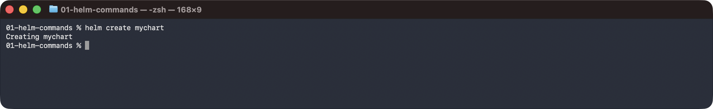

```sh
ls mychart
```

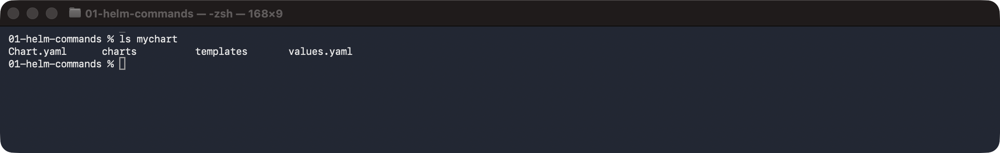

## helm repo

Adds and manages chart repositories.

```sh
helm repo add bitnami https://charts.bitnami.com/bitnami
```

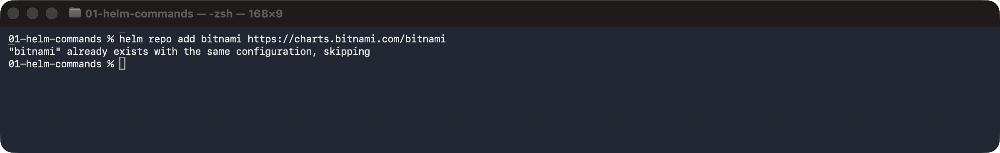

```sh
helm repo update
```

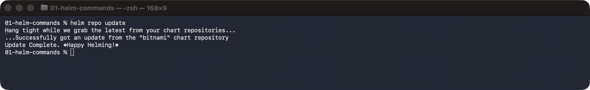

```sh
helm repo list
```

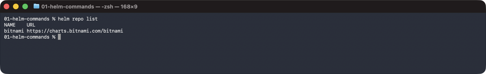

## helm search

Searches charts in added repositories.

```sh
helm search repo bitnami/nginx
```

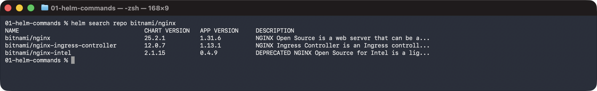

## helm install

Installs a chart as a named release.

```sh
helm install web ./mychart
```

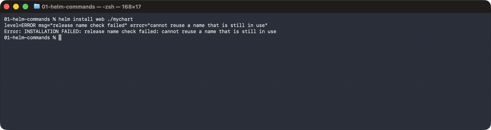

## helm list

Lists releases in the namespace.

```sh
helm list
```

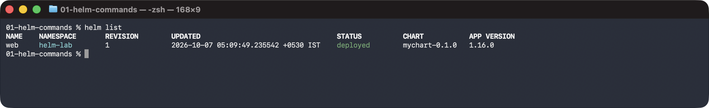

## helm status

Shows the status of a release.

```sh
helm status web
```

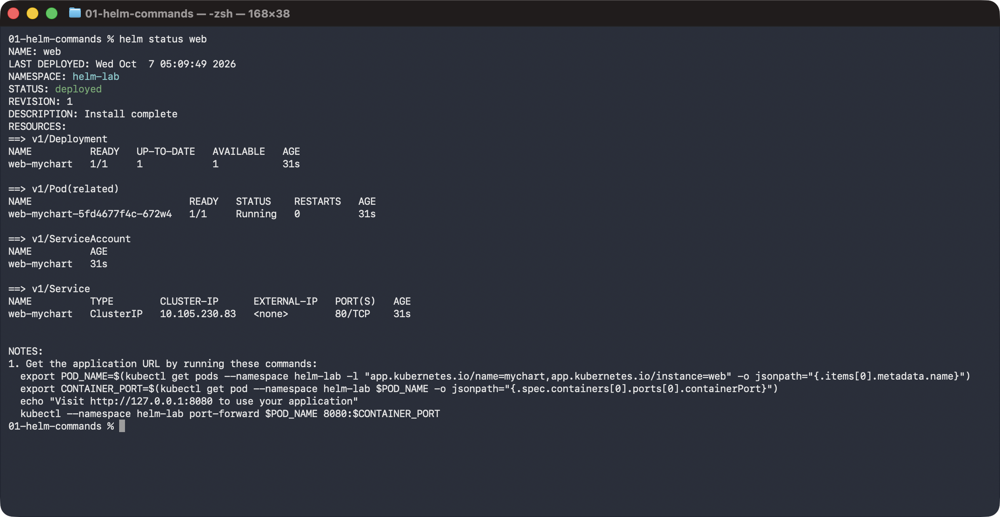

## helm get

Shows what a release deployed (values, notes, manifest).

```sh
helm get values web
```

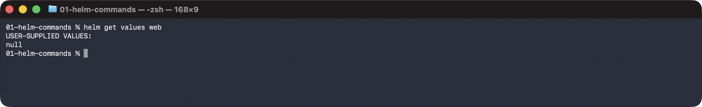

```sh
helm get notes web
```

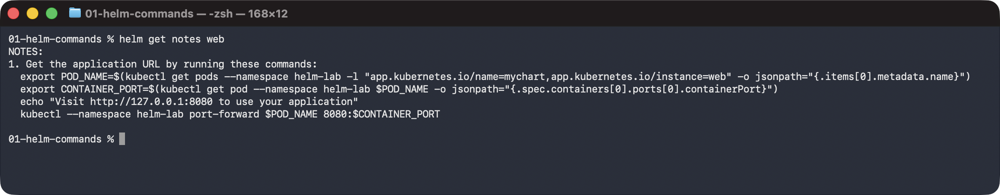

## helm upgrade

Upgrades a release with new values/chart (creates a new revision).

```sh
helm upgrade web ./mychart --set replicaCount=2
```

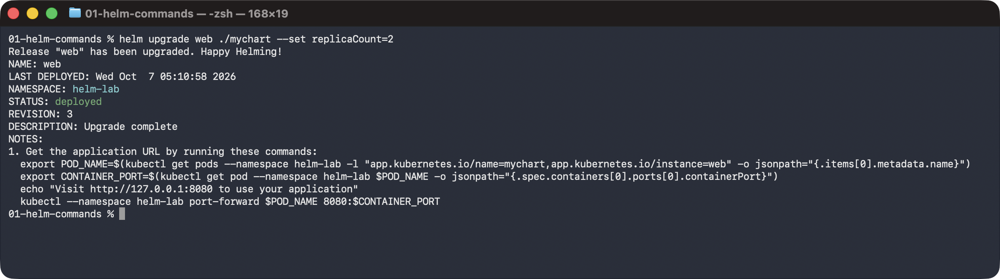

## helm history

Lists the revisions of a release.

```sh
helm history web
```

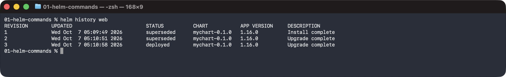

## helm rollback

Rolls a release back to an earlier revision.

```sh
helm rollback web 1
```

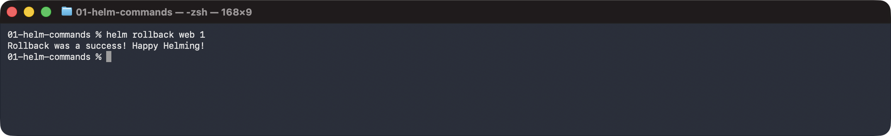

```sh
helm history web
```

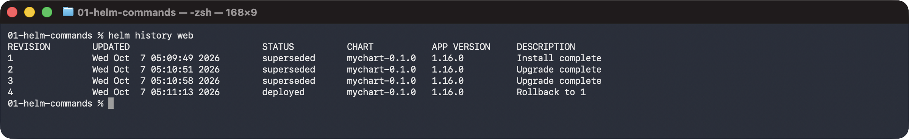

## helm uninstall

Removes a release and its resources.

```sh
helm uninstall web
```

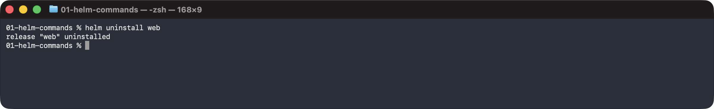

```sh
helm list
```

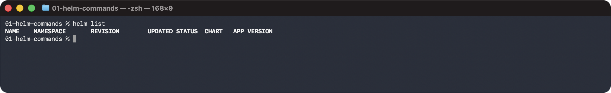
