# Task 2: Helm Rollback

## 1. Install

```sh
helm install app ./mychart
```

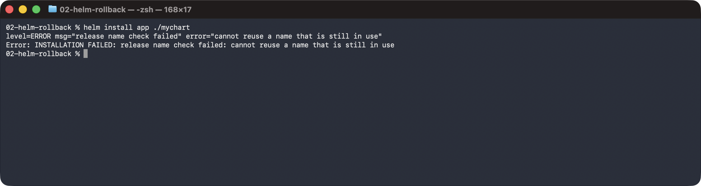

## 2. Verify

```sh
helm list
```

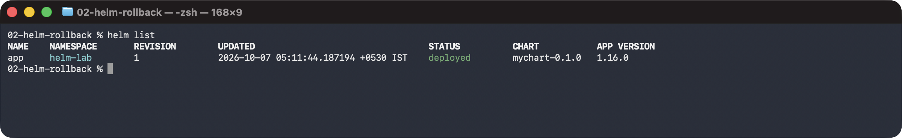

```sh
kubectl get deployment app-mychart -o wide
```

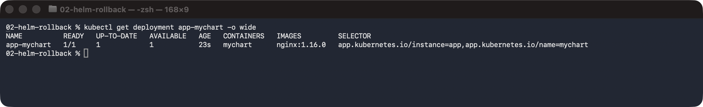

## 3. Upgrade (replicas 2)

```sh
helm upgrade app ./mychart --set replicaCount=2
```

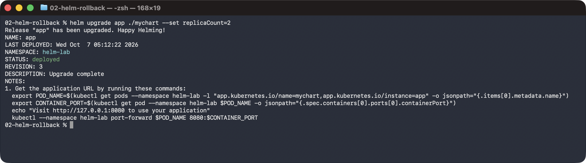

## 4. Verify

```sh
helm history app
```

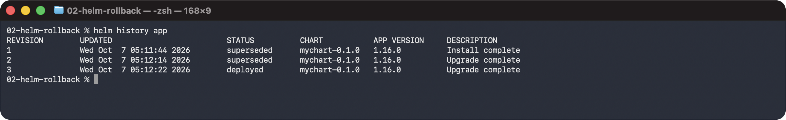

```sh
kubectl get deployment app-mychart -o wide
```

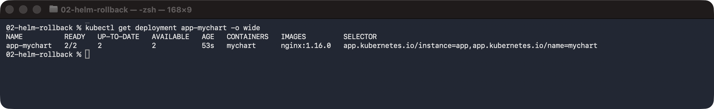

## 5. Upgrade again (replicas 3, image nginx:1.27)

```sh
helm upgrade app ./mychart --set replicaCount=3 --set image.tag=1.27
```

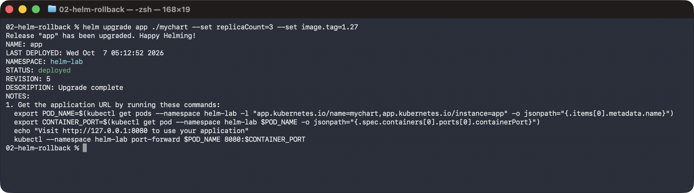

## 6. Verify

```sh
helm history app
```

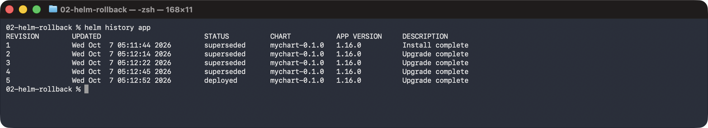

```sh
kubectl get deployment app-mychart -o wide
```


## 7. Rollback to revision 2

```sh
helm rollback app 2
```

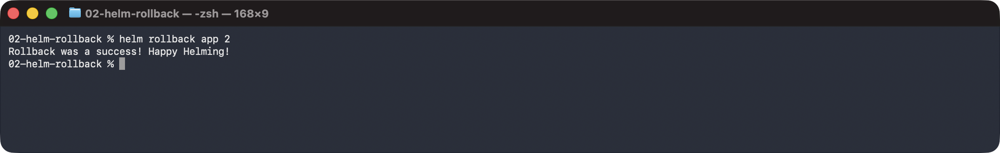

## 8. Verify

```sh
helm history app
```

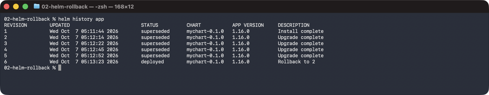

```sh
kubectl get deployment app-mychart -o wide
```

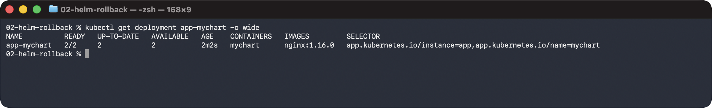

```sh
helm get values app
```

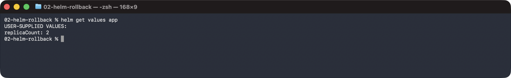
