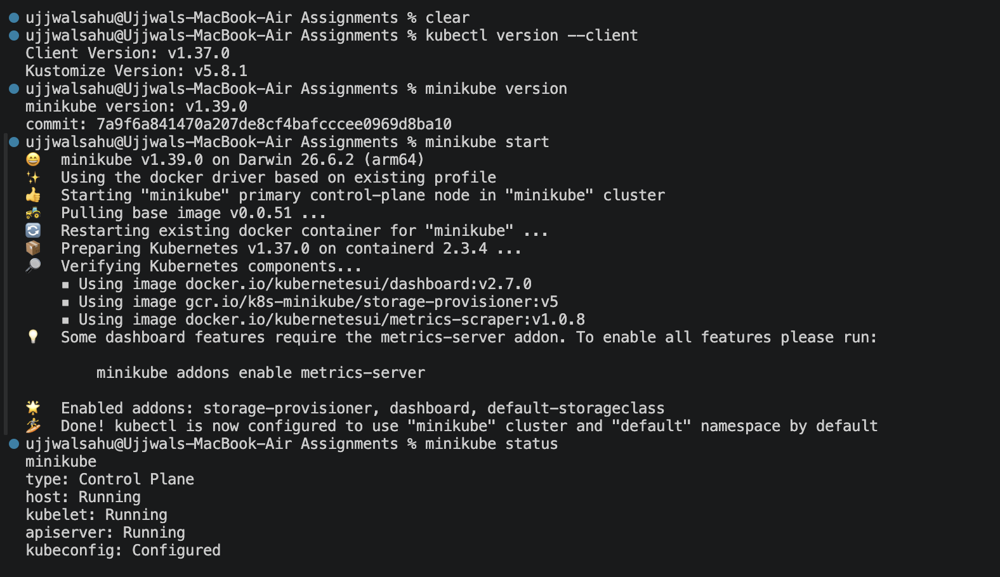
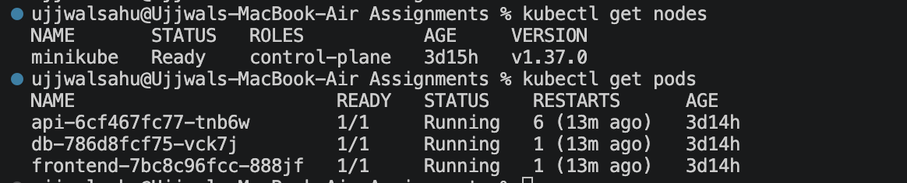

# Kubernetes Fundamentals Assignment

> ### Task

## Kubernetes architecture

Kubernetes follows a master-worker architecture. The control plane manages the cluster state, schedules workloads, and keeps APIs and stored configuration in sync. It includes components like the API server, scheduler, controller manager, and etcd. Worker nodes run the actual application containers. Each node has a kubelet to communicate with the control plane, a container runtime (such as containerd or Docker), and a kube-proxy for networking. Together, these components ensure workloads are deployed, scaled, healed, and exposed reliably across the cluster.

