# Kubernetes ConfigMaps, Secrets & Ingress Assignment

> ### Task 1 - ConfigMap

## Create ConfigMap & store configuration values

```sh
kubectl apply -f configmap.yaml
kubectl describe configmap app-config -n icms-lab
```

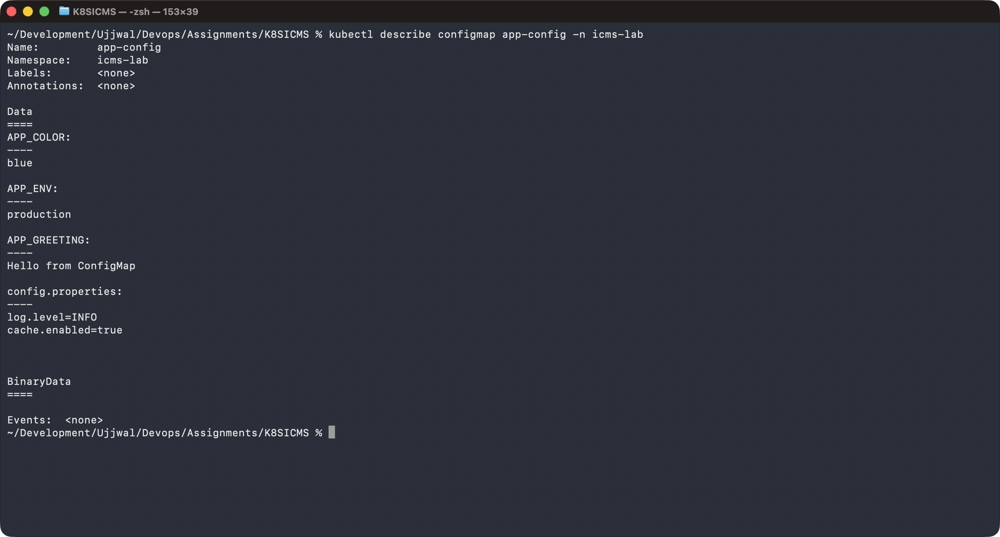

## Inject ConfigMap into Pod

```sh
kubectl apply -f configmap-pod.yaml
```

## Verify values inside the container

```sh
kubectl exec configmap-demo -n icms-lab -- sh -c 'env | grep APP_'
```

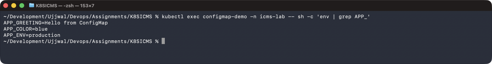

```sh
kubectl exec configmap-demo -n icms-lab -- cat /etc/config/config.properties
```

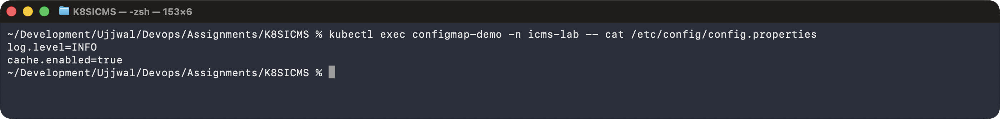

---

> ### Task 2 - Secret

## Create Secret & store sensitive values

```sh
kubectl apply -f secret.yaml
kubectl get secret app-secret -n icms-lab -o yaml
```

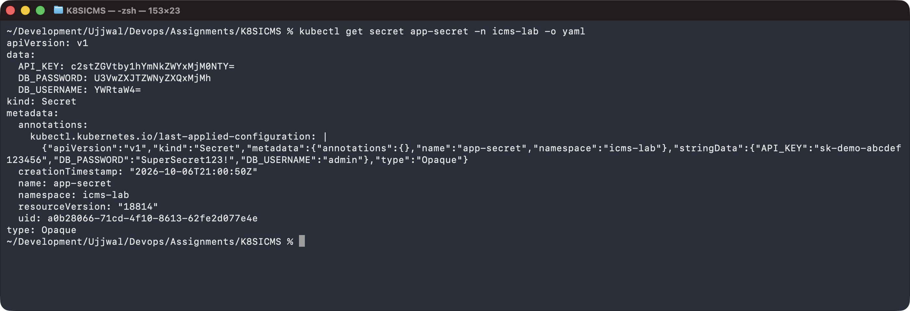

```sh
kubectl get secret app-secret -n icms-lab -o jsonpath='{.data.DB_PASSWORD}' | base64 -d; echo
```

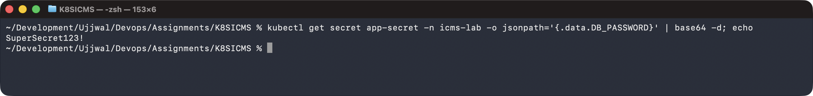

## Inject Secret into Pod

```sh
kubectl apply -f secret-pod.yaml
```

## Verify the value inside the container

```sh
kubectl exec secret-demo -n icms-lab -- sh -c 'env | egrep "DB_|API_KEY"'
```

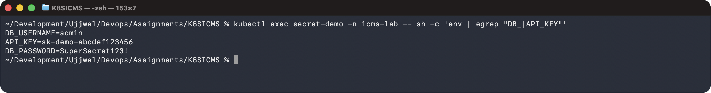

```sh
kubectl exec secret-demo -n icms-lab -- cat /etc/secret/DB_PASSWORD
```


## Why Secrets should not be committed to Git

- **Base64 is encoding, not encryption.** Anyone with the YAML can recover the plaintext with a single `base64 -d` (shown above) — no cluster access needed.
- **Git history is forever.** Even if the file is deleted in a later commit, the value stays recoverable from history, and the credential must be treated as compromised and rotated.
- **Repos get shared, forked, mirrored and cached**, so a secret committed once can end up far outside your control.
- **Secrets have their own lifecycle** (rotation, per-environment values, access control) that shouldn't be tied to source-control commits.
- **Correct practice:** keep real Secret manifests out of Git or create them at deploy time (`kubectl create secret --from-literal=`); use Sealed Secrets, SOPS, External Secrets Operator or Vault/KMS for GitOps; enable encryption at rest for etcd and restrict RBAC `get`/`list` on `secrets`.

---

> ### Task 3 - Ingress

## Deploy application

```sh
kubectl apply -f ingress-app.yaml
kubectl rollout status deployment/icms-web -n icms-lab
```

## Create Service

```sh
kubectl apply -f ingress-service.yaml
kubectl get svc,endpoints -n icms-lab
```

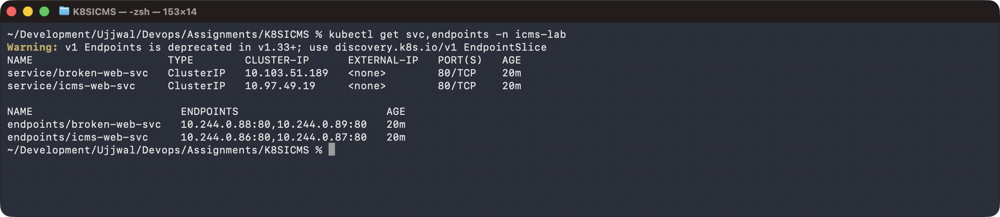

## Configure Ingress

```sh
kubectl apply -f ingress.yaml
kubectl get ingress -n icms-lab
kubectl describe ingress icms-web-ingress -n icms-lab
```

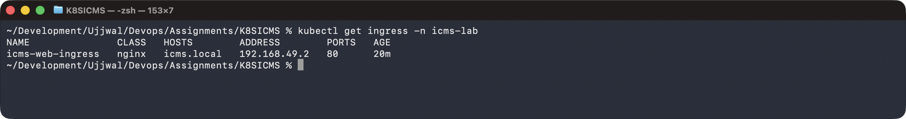

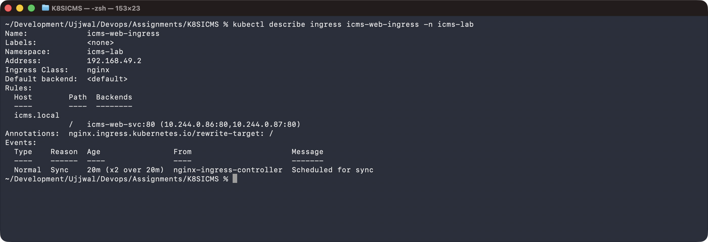

## Access application through Ingress & verify routing

```sh
kubectl port-forward -n ingress-nginx svc/ingress-nginx-controller 18080:80 &
curl -H 'Host: icms.local' http://localhost:18080/
```

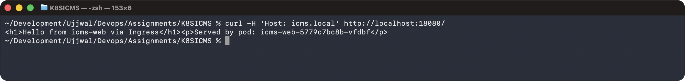

Request with a non-matching host returns the default backend's 404:

```sh
curl -i -H 'Host: not-configured.local' http://localhost:18080/
```

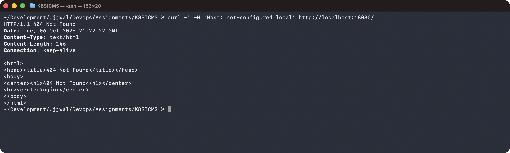

---

> ### Task 4 - Ingress vs Ingress Controller

## What is Ingress?

An **Ingress** is a Kubernetes API object (`networking.k8s.io/v1`) that declares HTTP/HTTPS routing rules for traffic coming from outside the cluster — hostnames, URL paths, TLS, and which Service/port each goes to. On its own it is only configuration stored in etcd; it does nothing by itself.

## What is an Ingress Controller?

An **Ingress Controller** is the software (a Pod running a reverse proxy such as ingress-nginx, Traefik, HAProxy or a cloud LB integration) that watches the API server for `Ingress` objects, translates them into proxy configuration, listens on a port, and routes connections to the backend Service's Pods. None is installed by default — hence `minikube addons enable ingress` in Task 3.

## Difference between them

| Aspect | Ingress | Ingress Controller |
|---|---|---|
| What it is | API object / routing spec | Running workload (reverse proxy / load balancer) |
| Where it lives | etcd, via the API server | Pods in the cluster (e.g. `ingress-nginx` namespace) |
| Does it work alone? | No — inert config | No — needs Ingress objects to know what to route |
| Provided by | Kubernetes core API | Third party (nginx, Traefik, HAProxy, cloud) — you install it |
| Analogy | Seating chart | The host who reads it and seats the guests |

## Why both are required

The Ingress expresses **intent**; the controller provides the **mechanism**. An Ingress with no controller routes nothing, and a controller with no Ingress objects has nothing to route (it just serves its default 404 backend).

## Examples

- Ingress: `icms-web-ingress` — routes `icms.local` to `icms-web-svc:80`.
- Controller: the `ingress-nginx-controller` Pod in the `ingress-nginx` namespace.
- Other controllers: Traefik, HAProxy Ingress, AWS ALB, GKE Ingress.

---

> ### Task 5 - Troubleshooting

## Identify the problem

A Service (`broken-web-svc`) does not route traffic to a healthy Deployment (`broken-web`).

```sh
kubectl apply -f troubleshooting/app.yaml
kubectl apply -f troubleshooting/service-broken.yaml
```

## Run troubleshooting commands

```sh
kubectl get pods -n icms-lab -l app=broken-web -o wide
```

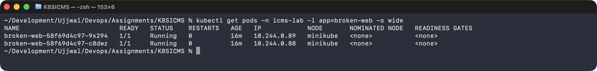

```sh
kubectl get svc,endpoints broken-web-svc -n icms-lab
```

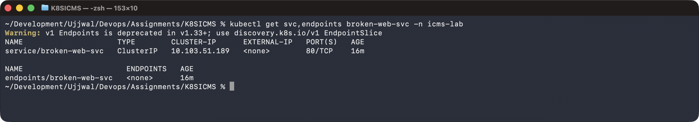

```sh
kubectl describe svc broken-web-svc -n icms-lab
```

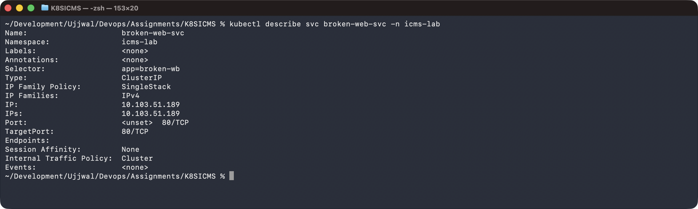

```sh
kubectl port-forward -n icms-lab svc/broken-web-svc 18081:80 &
curl -sS -m 5 http://localhost:18081/
```

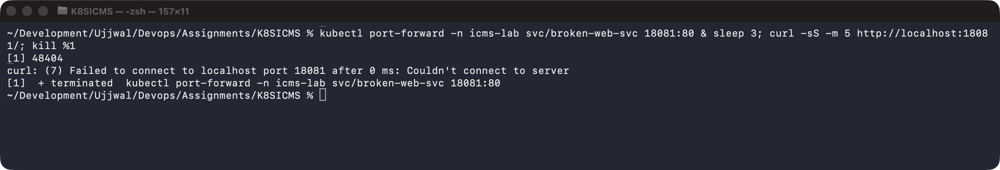

## Find the root cause

`kubectl describe svc` shows `Selector: app=broken-wb`, but the Pods are labelled `app=broken-web`. The one-character typo means the selector matches zero Pods, so the Service has `Endpoints: <none>`. The Pods and app are fine; the Service simply isn't pointed at anything.

## Fix the issue

```sh
kubectl apply -f troubleshooting/service-fixed.yaml   # selector: app=broken-web
```

## Before / after

```sh
kubectl get svc,endpoints broken-web-svc -n icms-lab
```

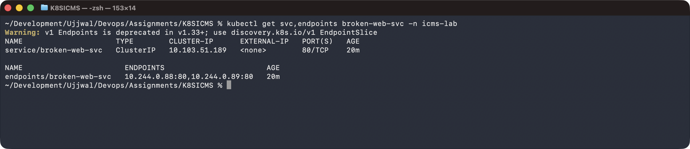

```sh
curl -i http://localhost:18081/
```

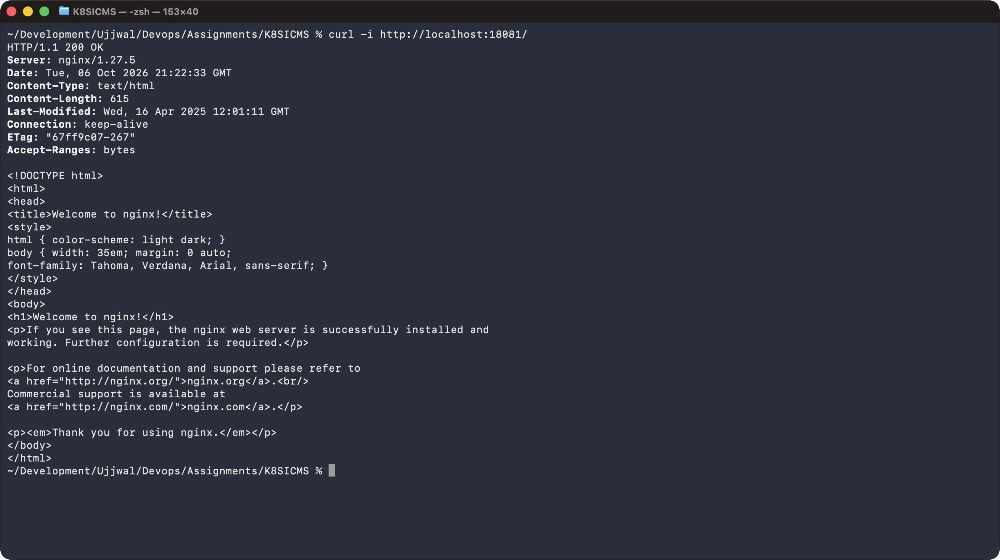
