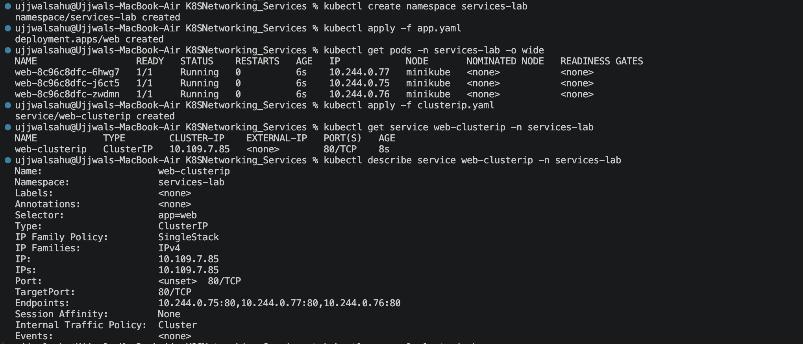
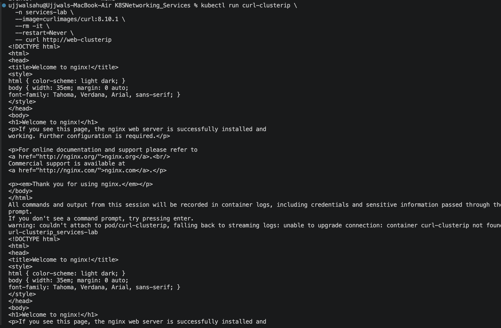
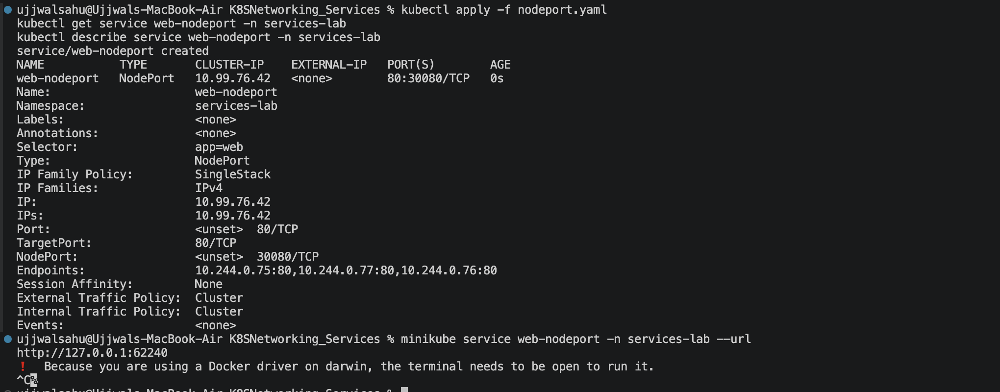
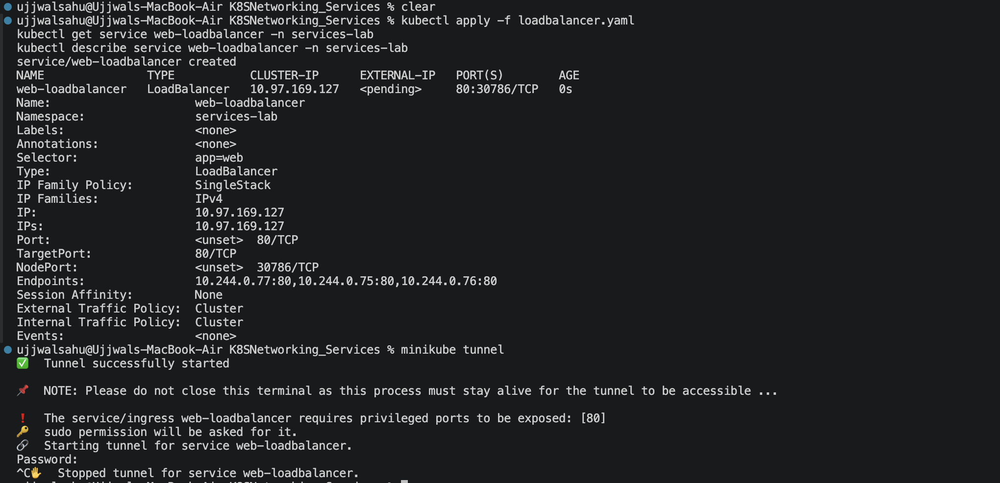
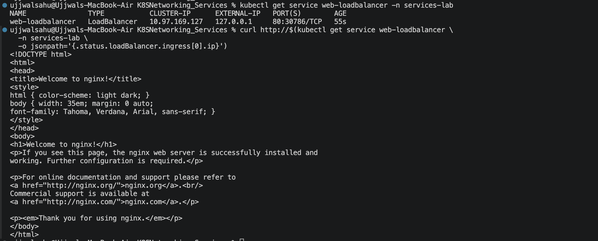
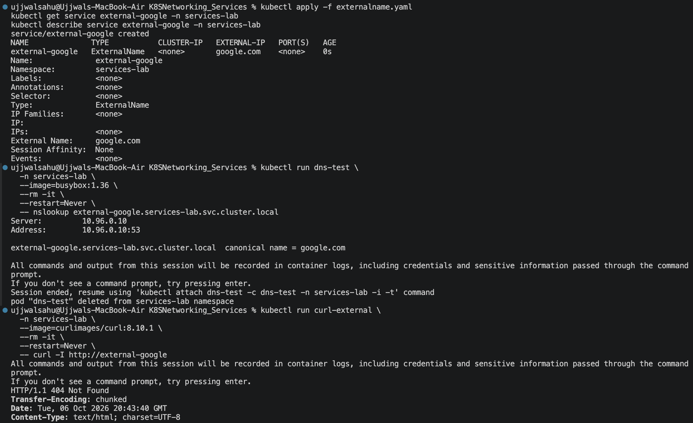
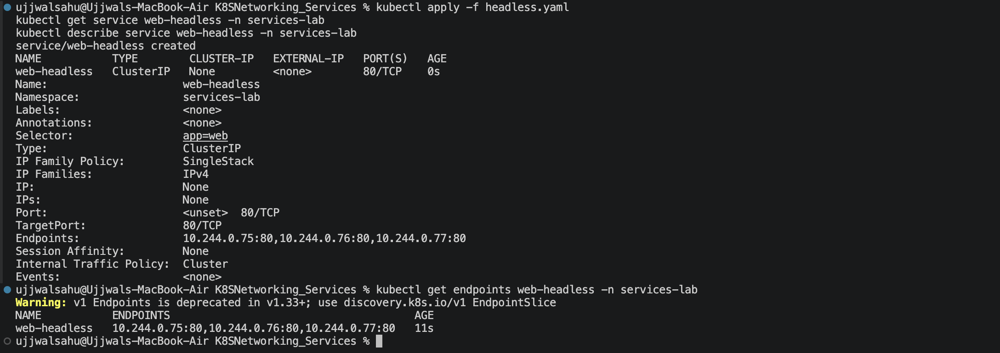

# Kubernetes Networking & Services Assignment

> ### Task 1
## Kubernetes Services















# Kubernetes Object Comparison

## Deployment vs ReplicaSet

A **ReplicaSet** keeps a specified number of matching Pods running. A **Deployment** manages ReplicaSets and provides declarative updates for stateless applications.

| Aspect | Deployment | ReplicaSet |
|---|---|---|
| Purpose | Manage an application's desired state and rollout history | Maintain the desired number of identical Pods |
| Pod management | Creates and manages ReplicaSets, which create/manage Pods | Creates replacement Pods when matching Pods are missing |
| Scaling | Change the Deployment's replica count; its ReplicaSet is adjusted | Change the ReplicaSet's replica count directly |
| Rolling updates | Supports rolling updates and rollbacks by creating and scaling ReplicaSets | Does not provide rollout or rollback management |
| Relationship | Higher-level controller that owns and coordinates ReplicaSets | Usually created and managed by a Deployment |

In normal application deployments, manage replicas through the Deployment rather than editing its ReplicaSet directly.

## Deployment vs DaemonSet vs StatefulSet

| Aspect | Deployment | DaemonSet | StatefulSet |
|---|---|---|---|
| Use cases | Stateless workloads such as web apps and APIs | Node-level agents such as log collectors, monitoring agents, and network plugins | Stateful applications that need stable identity or persistent storage, such as databases |
| Pod creation | Creates interchangeable Pods, usually distributed by the scheduler | Ensures a Pod runs on every eligible node (or selected nodes) | Creates Pods with stable, ordered identities such as `app-0` and `app-1` |
| Scaling | Set a desired replica count | Pods are added or removed as eligible nodes are added or removed; not scaled by a replica count | Set the replica count; Pods are typically created or removed in order |
| Networking | Pods are replaceable and get changing IPs; a Service is commonly used for stable access | Each Pod runs on a node; a Service can provide access to the set | Stable Pod hostnames are available through a headless Service; a regular Service can also provide a shared endpoint |
| Storage | Usually ephemeral; persistent volumes can be used but are not tied to a particular Pod identity | Often uses node-local resources or host mounts; persistent volumes are possible | Commonly uses a `volumeClaimTemplate` to provide stable, per-Pod persistent volumes |
| Example | Multiple replicas of a stateless frontend | One log-shipping agent on each cluster node | A database cluster with a persistent volume per member |

## ReplicaSet vs Service

A **ReplicaSet** is a workload controller: it creates and replaces Pods to maintain the requested number of matching Pods. A **Service** is a networking abstraction: it provides a stable address and routes traffic to a changing set of backend Pods.

A Service is needed when clients need a reliable endpoint. Pods can be recreated with different IP addresses, while the Service's DNS name and virtual IP remain stable. A Service selects Pods using labels; Kubernetes tracks the matching backends (through EndpointSlices), and the cluster's networking implementation routes Service traffic to a ready Pod.

Typical traffic flow: **client → Service DNS name/ClusterIP → one of the Service's ready Pod endpoints**. The ReplicaSet maintains those Pods but does not provide the stable network endpoint or route client traffic to them.

## FQDN

An **FQDN (Fully Qualified Domain Name)** is the complete DNS name for a resource within a DNS hierarchy. Kubernetes DNS lets workloads find Services by name instead of relying on changing Pod IP addresses.

### Kubernetes Service DNS

For a Service, the standard DNS name is:

```text
<service-name>.<namespace>.svc.<cluster-domain>
```

The cluster domain is `cluster.local` by default, but it can be configured differently. For example, a Service named `api` in the `production` namespace typically has the FQDN:

```text
api.production.svc.cluster.local
```

### Namespace-based naming and Pod-to-Service communication

Pods in the same namespace can usually reach a Service by its short name, such as `http://api`. From another namespace, use `<service-name>.<namespace>` (for example, `api.production`), or use the full FQDN. DNS resolves the name to the Service's stable virtual IP; the Service then routes traffic to an available backend Pod.

Examples:

- `http://api` — Service `api` in the caller's namespace.
- `http://api.production` — Service `api` in the `production` namespace.
- `http://api.production.svc.cluster.local` — the full Service FQDN, assuming the default cluster domain.
- `http://api.production.svc.cluster.local.` — the same FQDN written with an optional final DNS root dot.

## CoreDNS

**CoreDNS** is a flexible DNS server used by Kubernetes to provide cluster DNS. It watches Kubernetes resources and answers DNS queries for Services and, when configured, Pods. This allows applications to discover workloads by stable DNS names rather than tracking changing Pod IP addresses.

### Service discovery and query resolution

When a Pod looks up a name such as `api.production`, its DNS resolver sends a query to the cluster DNS Service, commonly named `kube-dns` in the `kube-system` namespace. The Pod's `/etc/resolv.conf` usually contains that DNS Service's IP and search domains. For a short name, the resolver appends search suffixes (such as the Pod's namespace and `svc.cluster.local`) and tries the resulting names.

CoreDNS's `kubernetes` plugin looks up the Service in the Kubernetes API and returns the matching DNS record. A normal ClusterIP Service resolves to its virtual IP; a headless Service resolves to the addresses of its endpoints. The client connects to the returned address, and Kubernetes networking routes Service traffic to a ready backend Pod. Queries outside the cluster domain can be forwarded upstream, depending on the CoreDNS configuration.

### CoreDNS configuration

CoreDNS is typically deployed as Pods behind the `kube-dns` Service in `kube-system`. Its Corefile is commonly stored in the `coredns` ConfigMap in that namespace. The Corefile configures plugins, for example:

- `kubernetes` — serves DNS records for Kubernetes Services and Pods.
- `forward` — sends queries for other domains to upstream DNS servers.
- `cache` — caches answers to reduce repeated lookup work.
- `errors` and `log` — report errors and, when enabled, log queries.

Inspect the active configuration and deployment with:

```sh
kubectl -n kube-system get configmap coredns -o yaml
kubectl -n kube-system get deployment coredns
```

### Troubleshooting DNS

Check these items in order:

1. Confirm the Service exists, has the expected name and namespace, and has ready endpoints:
   ```sh
   kubectl get service api -n production
   kubectl get endpointslice -n production
   ```
2. Check that CoreDNS Pods are running and inspect their logs:
   ```sh
   kubectl get pods -n kube-system -l k8s-app=kube-dns
   kubectl logs -n kube-system -l k8s-app=kube-dns
   ```
3. From an affected Pod, inspect `/etc/resolv.conf` and query both the short name and FQDN (using a diagnostic image that includes `nslookup` or `dig`):
   ```sh
   nslookup api.production.svc.cluster.local
   ```
4. If DNS resolves but connections fail, verify Service selectors, ready Pod labels, ports, and network policies; resolution alone does not guarantee that the application is reachable.