### Kubernetes Pods, ReplicaSets & Deployments Assingment

> ### Task 1 - Deployment Strategies

## Rolling Update

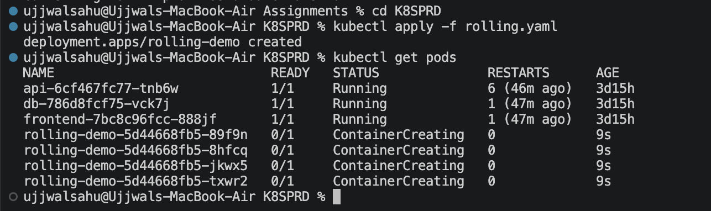

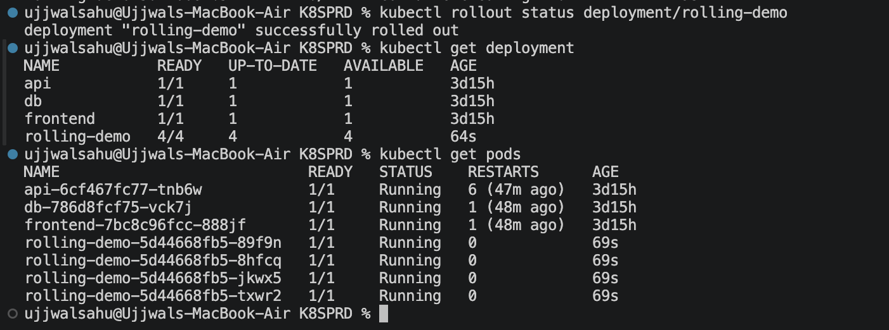

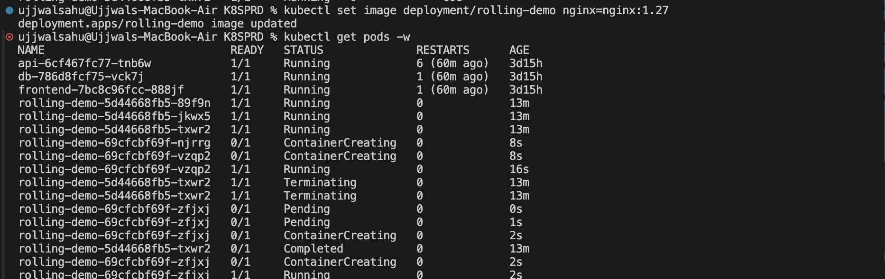

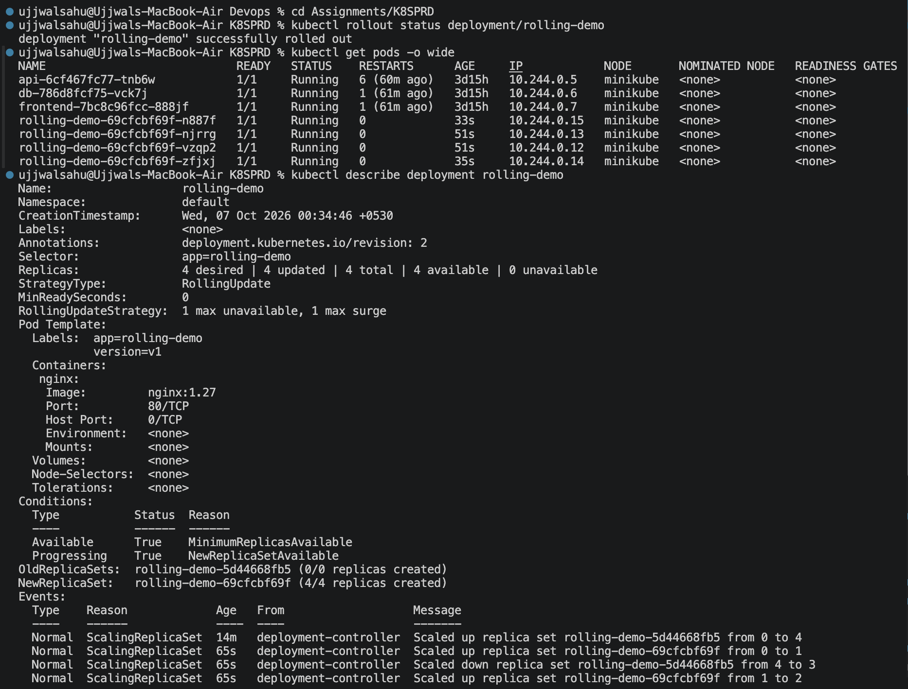

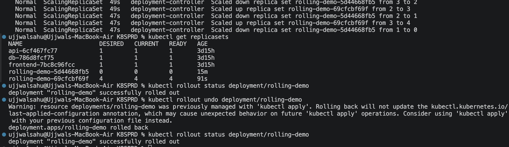

## Blue-Green Deployment

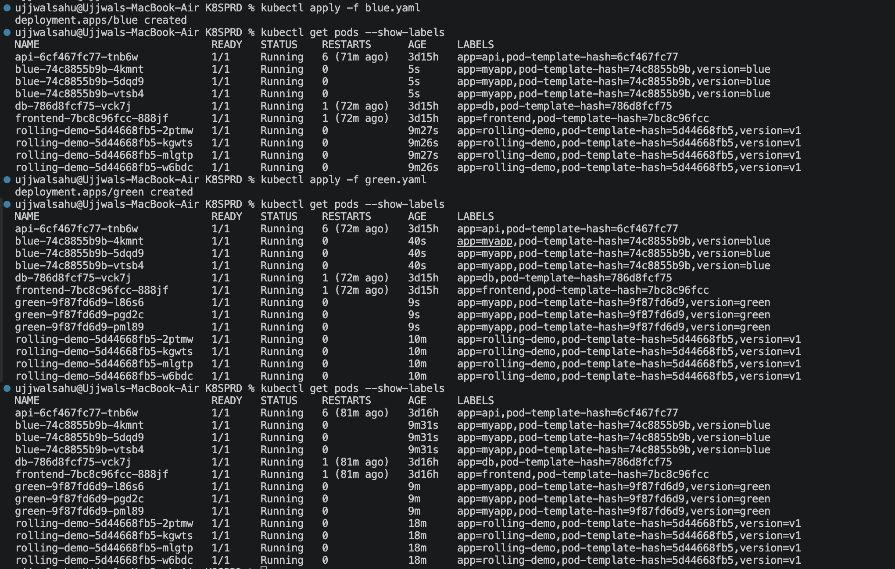

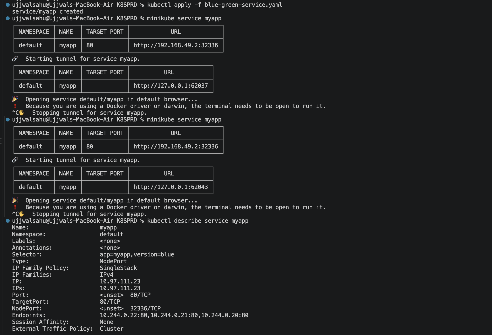

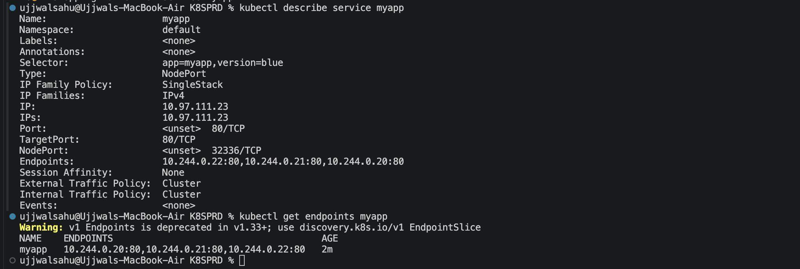

## Canary Deployment

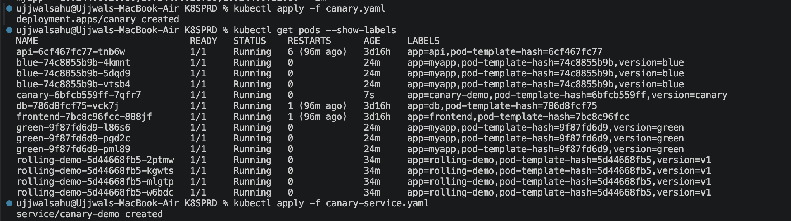

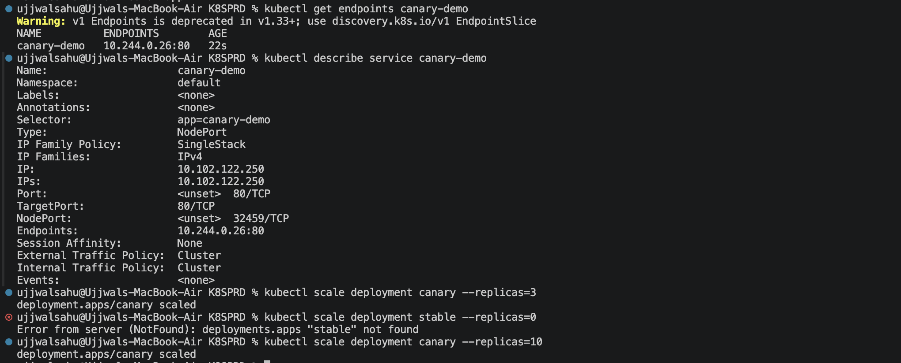

### Recreate Deployment

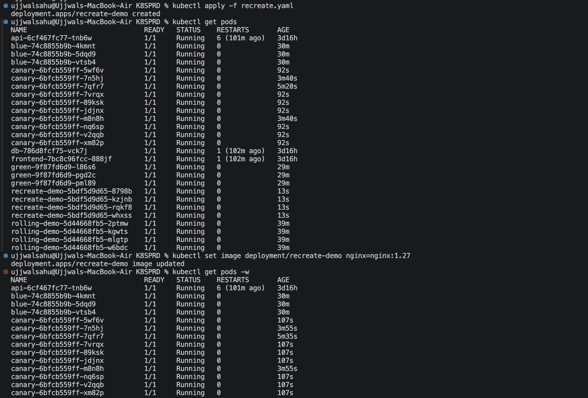

