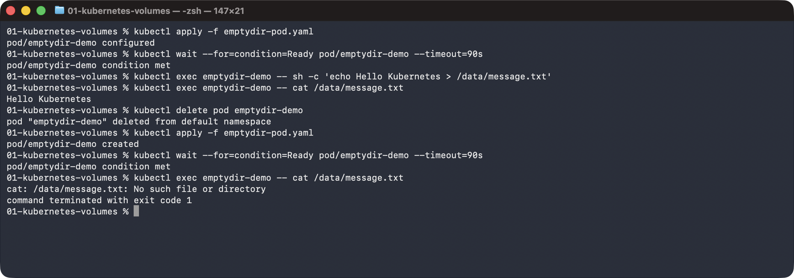
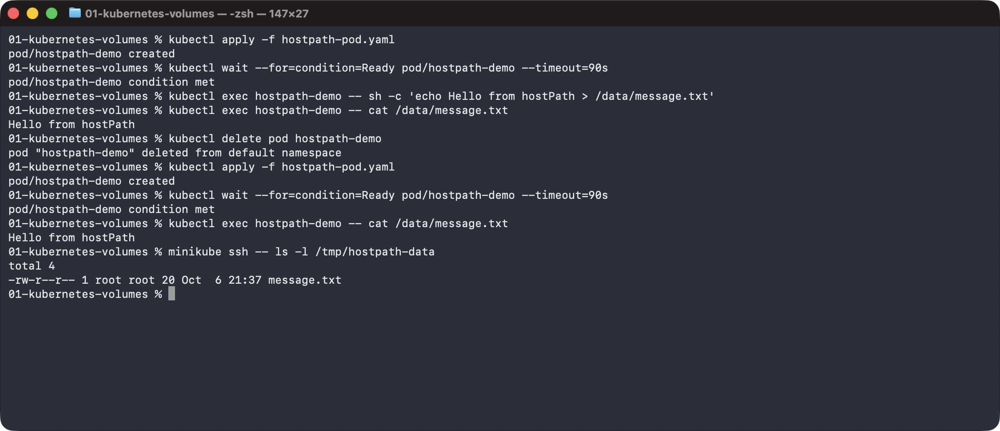
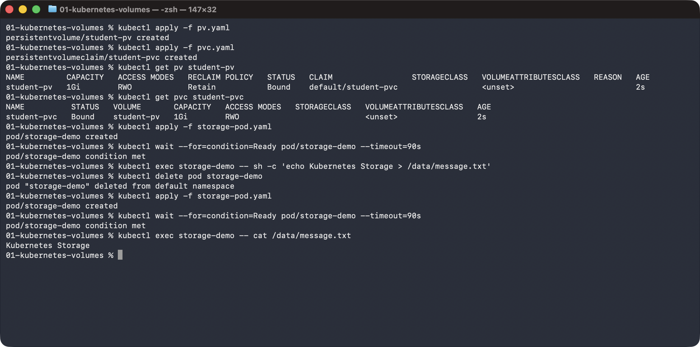
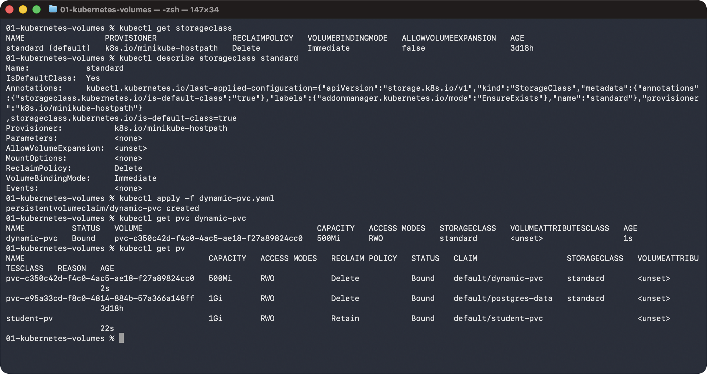

# Task 1: Kubernetes Volumes

## emptyDir

A temporary directory created when the Pod starts and shared by its containers. It is deleted when the Pod is deleted.

```sh
kubectl apply -f emptydir-pod.yaml
kubectl exec emptydir-demo -- sh -c 'echo Hello Kubernetes > /data/message.txt'
kubectl delete pod emptydir-demo
kubectl apply -f emptydir-pod.yaml
kubectl exec emptydir-demo -- cat /data/message.txt
```



## hostPath

Mounts a directory from the node into the Pod. Data survives the Pod but is tied to that node, so it is meant for learning and local testing, not production data.

```sh
kubectl apply -f hostpath-pod.yaml
kubectl exec hostpath-demo -- sh -c 'echo Hello from hostPath > /data/message.txt'
kubectl delete pod hostpath-demo
kubectl apply -f hostpath-pod.yaml
kubectl exec hostpath-demo -- cat /data/message.txt
minikube ssh -- ls -l /tmp/hostpath-data
```



## PersistentVolume (PV)

A piece of storage in the cluster with its own lifecycle, independent of any Pod. It defines capacity, access modes, reclaim policy and the backing storage.

## PersistentVolumeClaim (PVC)

A request for storage (size and access mode). Kubernetes binds it to a matching PV, and Pods mount the PVC, never the PV directly.

```sh
kubectl apply -f pv.yaml
kubectl apply -f pvc.yaml
kubectl get pv student-pv
kubectl get pvc student-pvc
kubectl apply -f storage-pod.yaml
kubectl exec storage-demo -- sh -c 'echo Kubernetes Storage > /data/message.txt'
kubectl delete pod storage-demo
kubectl apply -f storage-pod.yaml
kubectl exec storage-demo -- cat /data/message.txt
```



## StorageClass

Describes a type of storage (provisioner, reclaim policy, binding mode) and how to create it on demand. One class can be the default, used by any PVC that doesn't name a class.

## Dynamic provisioning

The PV is created automatically when a PVC requests storage from a StorageClass, so no PV has to be written by hand.

```sh
kubectl get storageclass
kubectl describe storageclass standard
kubectl apply -f dynamic-pvc.yaml
kubectl get pvc dynamic-pvc
kubectl get pv
```


