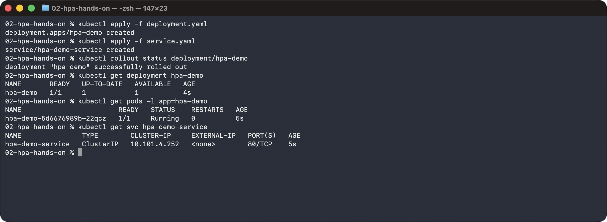
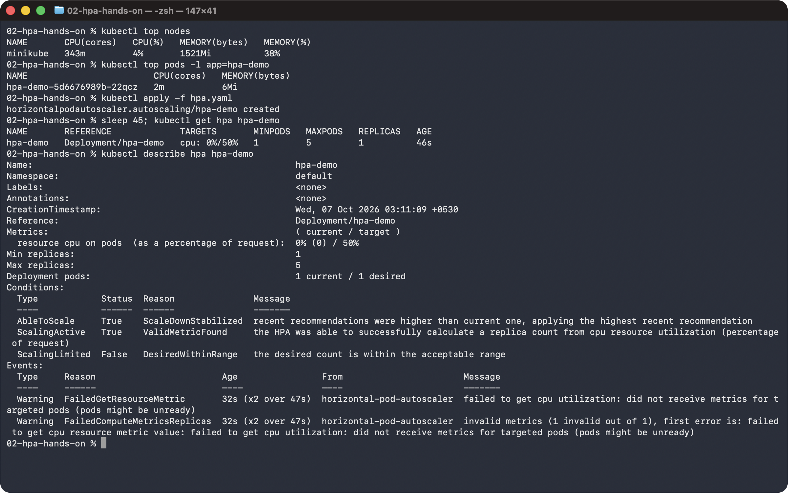
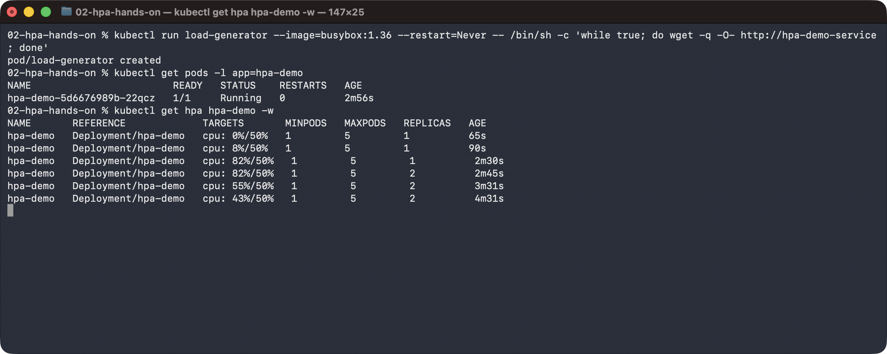
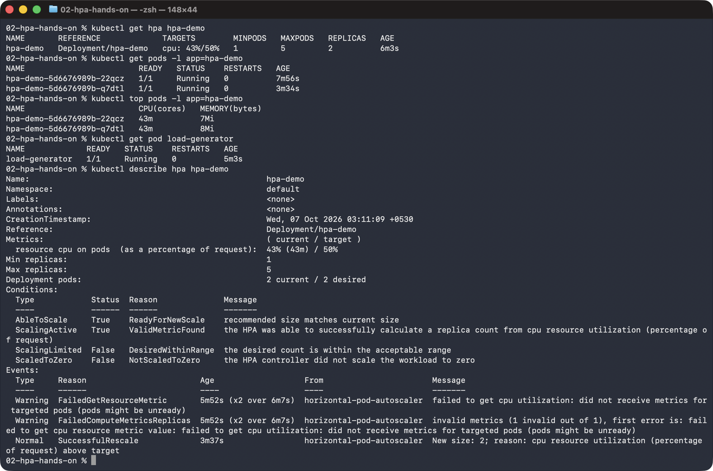
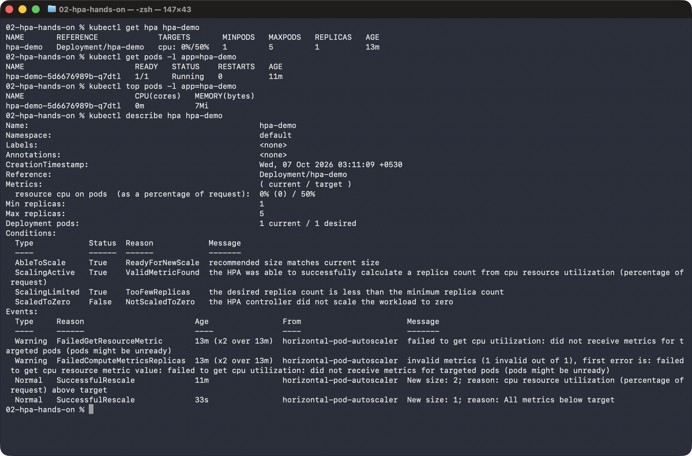

# Task 2: HPA Hands-on

## Deploy the application

```sh
kubectl apply -f deployment.yaml
kubectl apply -f service.yaml
kubectl rollout status deployment/hpa-demo
kubectl get deployment hpa-demo
kubectl get pods -l app=hpa-demo
kubectl get svc hpa-demo-service
```



## Configure and verify HPA

```sh
kubectl top nodes
kubectl top pods -l app=hpa-demo
kubectl apply -f hpa.yaml
kubectl get hpa hpa-demo
kubectl describe hpa hpa-demo
```



## Deploy a load generator and increase load

```sh
kubectl run load-generator --image=busybox:1.36 --restart=Never -- /bin/sh -c 'while true; do wget -q -O- http://hpa-demo-service; done'
kubectl get pods -l app=hpa-demo
kubectl get hpa hpa-demo -w
```



## Observe CPU utilization and Pod scaling

```sh
kubectl get hpa hpa-demo
kubectl get pods -l app=hpa-demo
kubectl top pods -l app=hpa-demo
kubectl get pod load-generator
kubectl describe hpa hpa-demo
```



## Stop the load and observe scale-down

```sh
kubectl delete pod load-generator
kubectl get hpa hpa-demo
kubectl get pods -l app=hpa-demo
kubectl top pods -l app=hpa-demo
kubectl describe hpa hpa-demo
```


