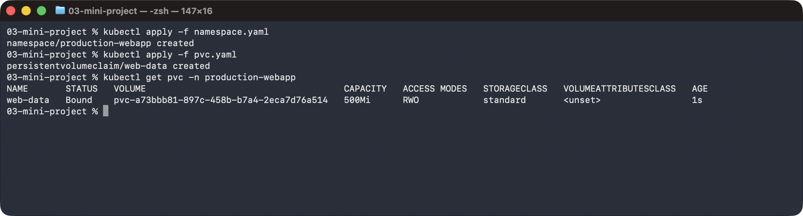
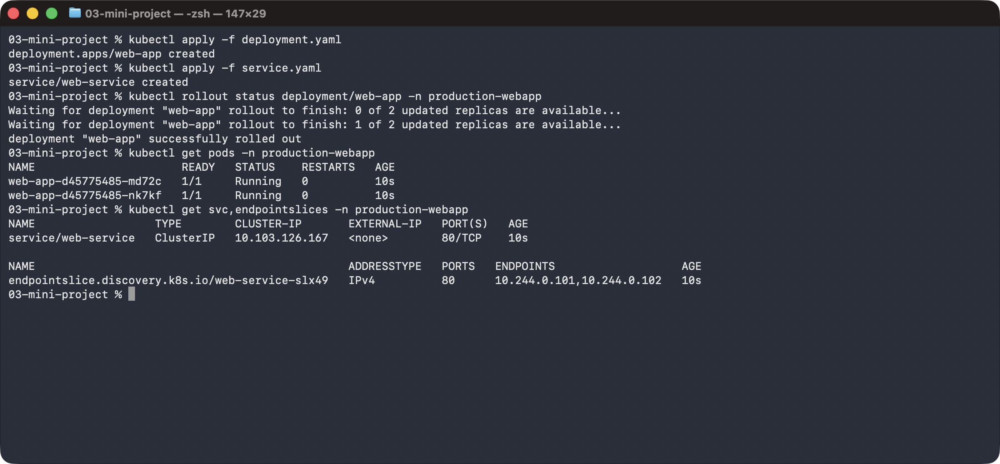
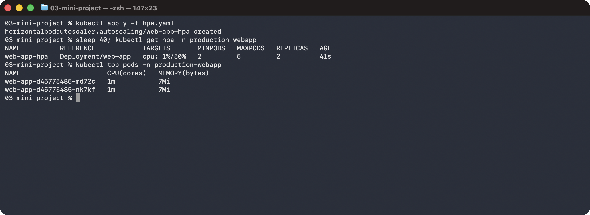
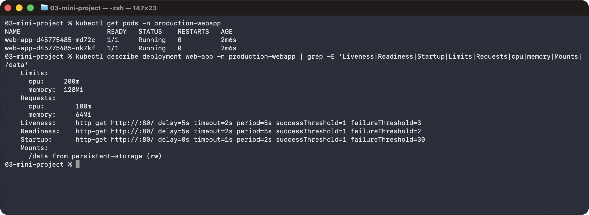
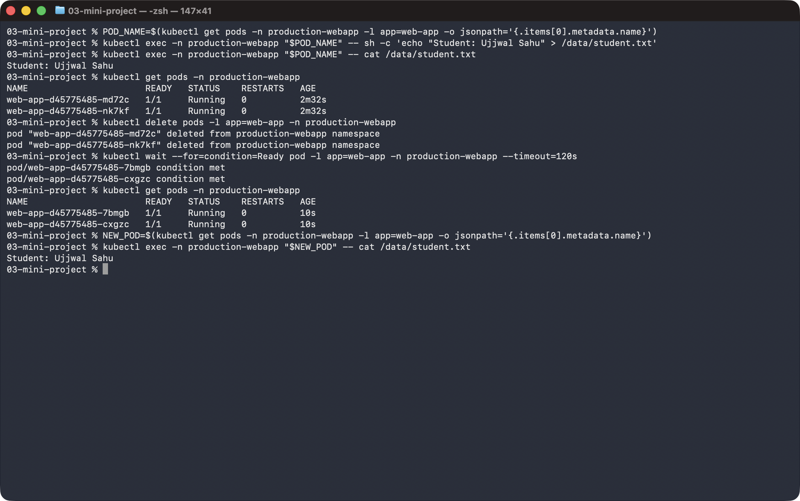
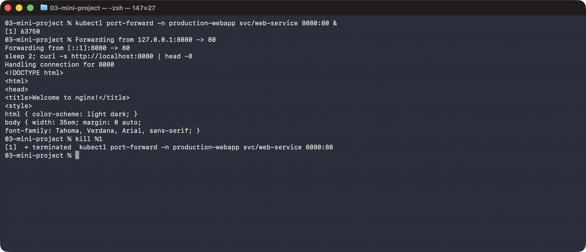
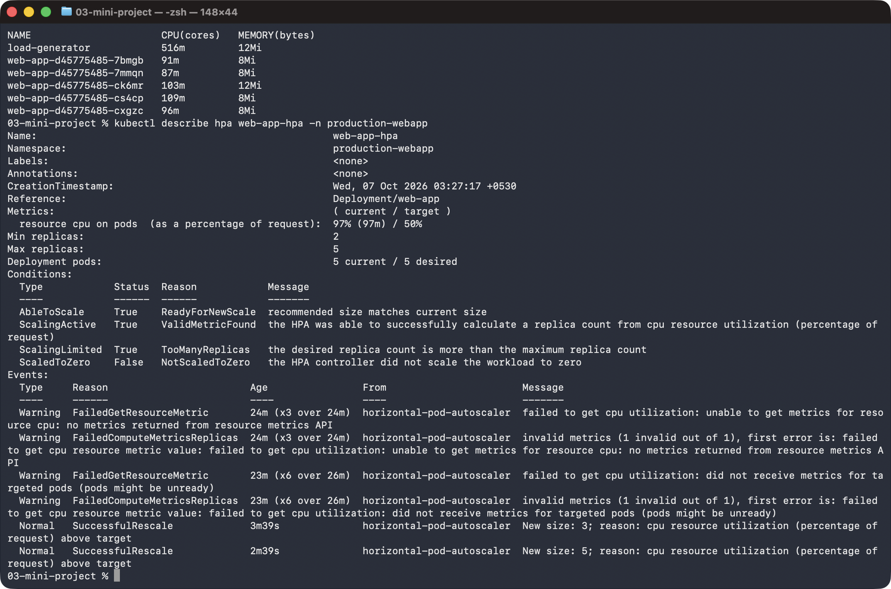

# Task 3: Mini Project

## Create namespace and PersistentVolumeClaim

```sh
kubectl apply -f namespace.yaml
kubectl apply -f pvc.yaml
kubectl get pvc -n production-webapp
```



## Deploy application and Service

```sh
kubectl apply -f deployment.yaml
kubectl apply -f service.yaml
kubectl rollout status deployment/web-app -n production-webapp
kubectl get pods -n production-webapp
kubectl get svc,endpointslices -n production-webapp
```



## Deploy the Horizontal Pod Autoscaler

```sh
kubectl apply -f hpa.yaml
kubectl get hpa -n production-webapp
kubectl top pods -n production-webapp
```



## Verify probes, resources and volume mount

```sh
kubectl get pods -n production-webapp
kubectl describe deployment web-app -n production-webapp | grep -E 'Liveness|Readiness|Startup|Limits|Requests|cpu|memory|Mounts|/data'
```



## Verify storage persistence

```sh
POD_NAME=$(kubectl get pods -n production-webapp -l app=web-app -o jsonpath='{.items[0].metadata.name}')
kubectl exec -n production-webapp "$POD_NAME" -- sh -c 'echo "Student: Ujjwal Sahu" > /data/student.txt'
kubectl exec -n production-webapp "$POD_NAME" -- cat /data/student.txt
kubectl get pods -n production-webapp
kubectl delete pods -l app=web-app -n production-webapp
kubectl wait --for=condition=Ready pod -l app=web-app -n production-webapp --timeout=120s
kubectl get pods -n production-webapp
NEW_POD=$(kubectl get pods -n production-webapp -l app=web-app -o jsonpath='{.items[0].metadata.name}')
kubectl exec -n production-webapp "$NEW_POD" -- cat /data/student.txt
```



## Verify the Service

```sh
kubectl port-forward -n production-webapp svc/web-service 8080:80 &
curl -s http://localhost:8080 | head -8
kill %1
```



## Trigger HPA scaling

```sh
kubectl delete pod load-generator -n production-webapp --ignore-not-found --wait=true
kubectl run load-generator -n production-webapp --image=httpd:2.4-alpine --restart=Never -- ab -c 50 -n 100000000 http://web-service/
sleep 90; kubectl get hpa -n production-webapp
kubectl get pods -n production-webapp
kubectl top pods -n production-webapp
kubectl describe hpa web-app-hpa -n production-webapp
```


