# Task 1: Kubernetes Troubleshooting Commands

## kubectl get

```sh
kubectl apply -f get-pod.yaml
```

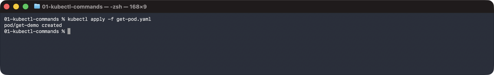

```sh
kubectl get pods
```

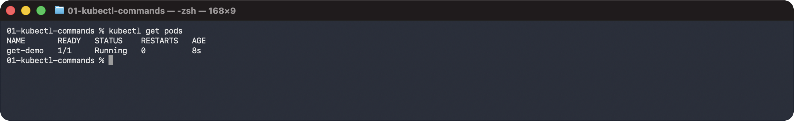

```sh
kubectl get pods --show-labels
```

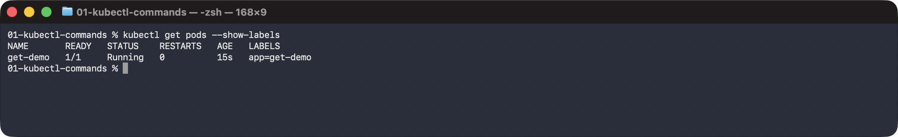

```sh
kubectl get pods,svc
```

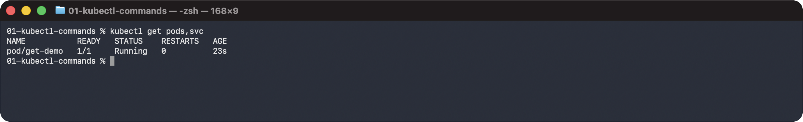

## kubectl get -o wide

```sh
kubectl get pods -o wide
```

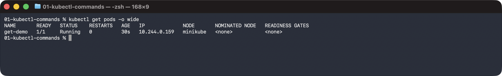

```sh
kubectl get nodes -o wide
```

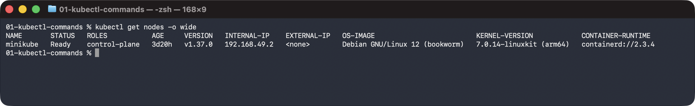

## kubectl describe

```sh
kubectl apply -f describe-pod.yaml
```

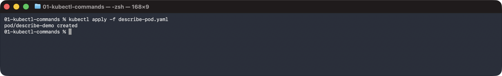

```sh
kubectl describe pod describe-demo
```

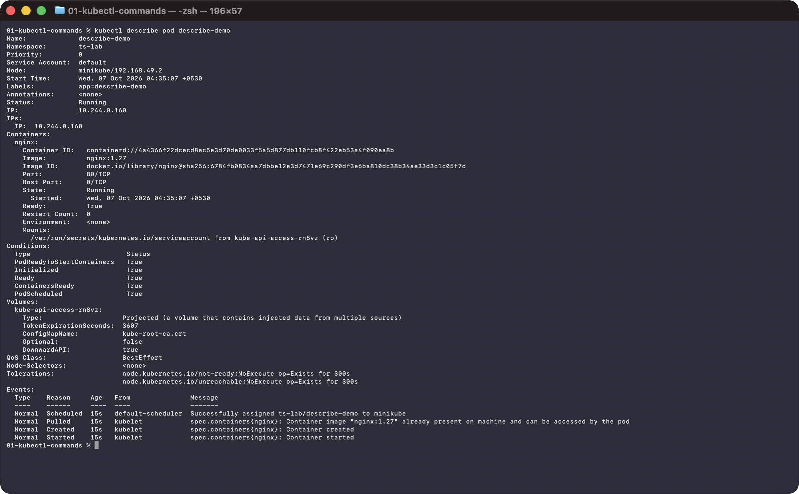

## kubectl logs

```sh
kubectl apply -f logs-pod.yaml
```


```sh
kubectl logs logs-demo
```

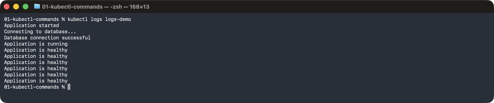

```sh
kubectl logs logs-demo --tail=3
```

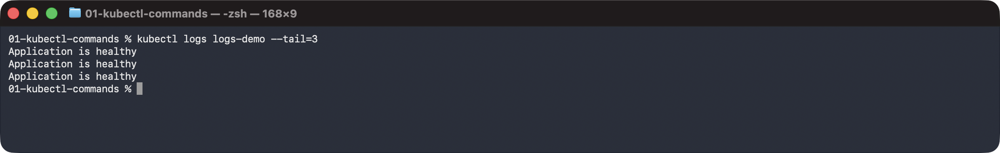

```sh
kubectl logs logs-demo --since=10s
```

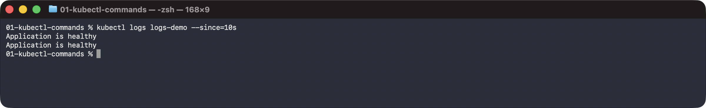

```sh
kubectl logs -f logs-demo
```

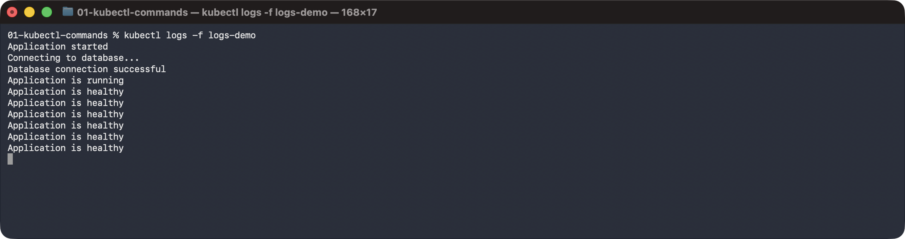

## kubectl exec

```sh
kubectl apply -f exec-pod.yaml
```

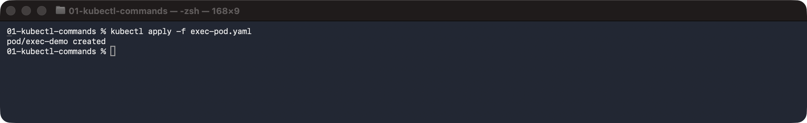

```sh
kubectl exec exec-demo -- hostname
```

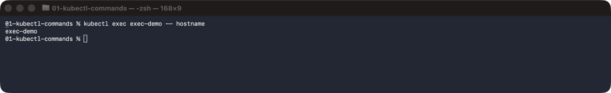

```sh
kubectl exec exec-demo -- ls /usr/share/nginx/html
```

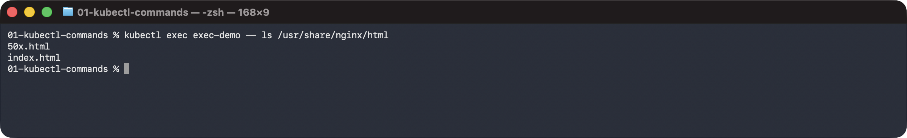

```sh
kubectl exec exec-demo -- cat /etc/os-release
```

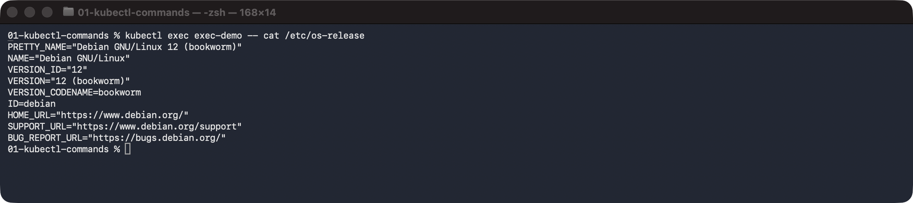

```sh
kubectl exec exec-demo -- curl -s localhost
```

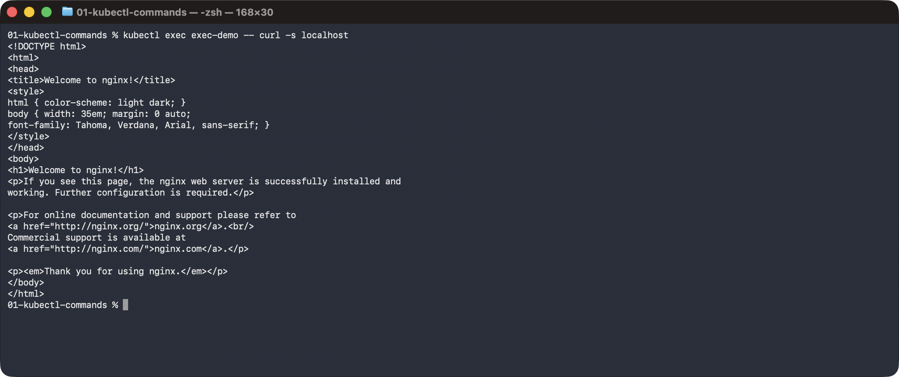

```sh
kubectl exec -it exec-demo -- sh -c 'echo inside $(hostname); nginx -v'
```

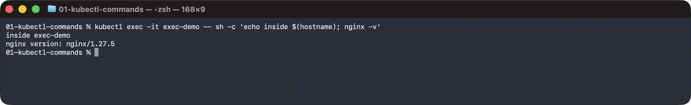

## kubectl events

```sh
kubectl apply -f events-pod.yaml
```

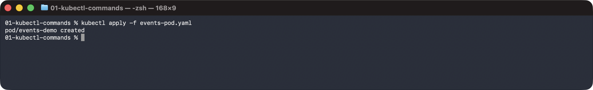

```sh
kubectl events --for pod/events-demo
```

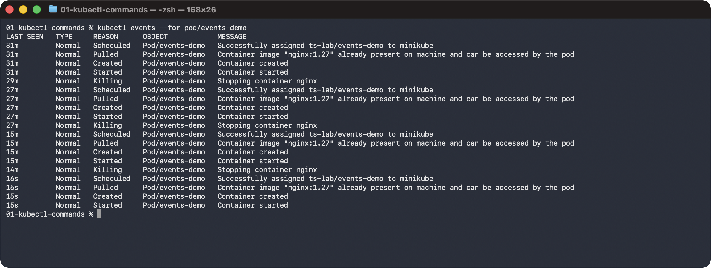

```sh
kubectl get events --field-selector involvedObject.name=events-demo --sort-by=.metadata.creationTimestamp
```

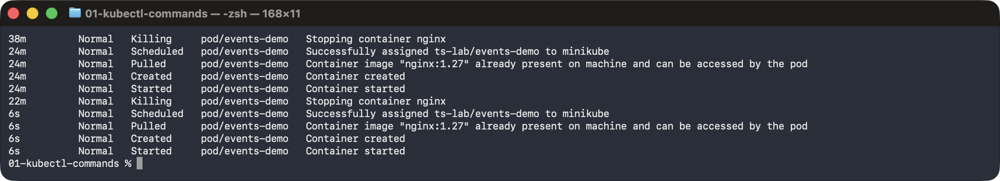

## kubectl explain

```sh
kubectl explain pod.spec.containers.image
```

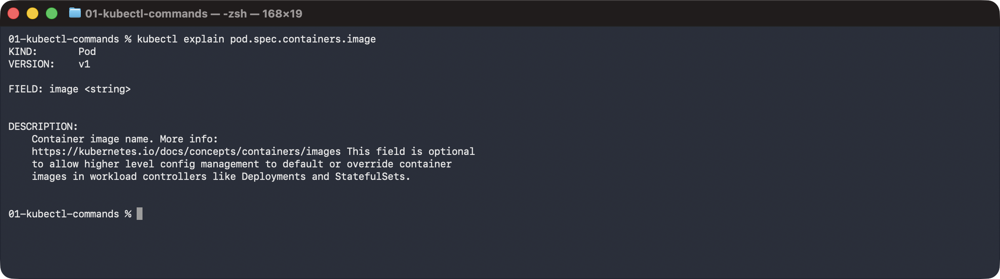

```sh
kubectl explain deployment.spec.replicas
```

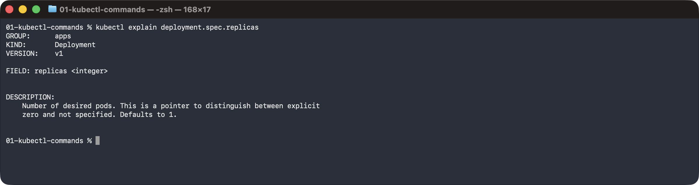

```sh
kubectl explain service.spec.selector
```

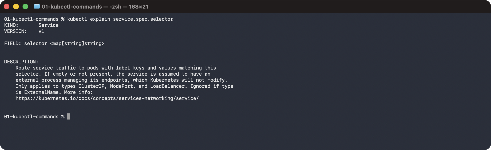

```sh
kubectl explain pod.metadata.labels
```

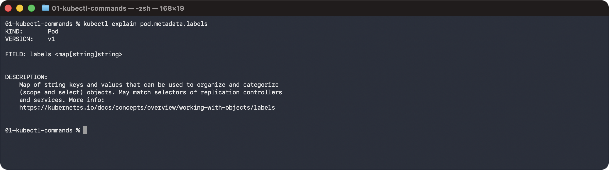

## kubectl top

```sh
kubectl top nodes
```

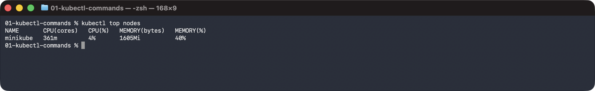

```sh
kubectl top pods
```

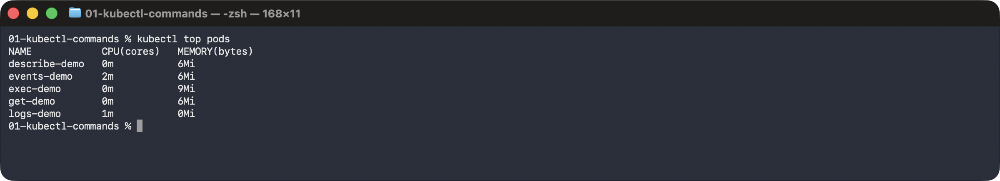

```sh
kubectl top pod --containers
```

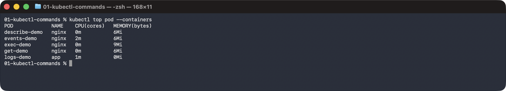
