# Task 2: Troubleshoot Common Issues

## CrashLoopBackOff

### Identify the problem

```sh
kubectl apply -f crashloop-broken.yaml
```


```sh
kubectl get pod crash-demo
```

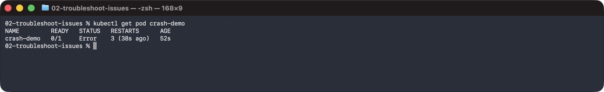

### Investigate

```sh
kubectl logs crash-demo
```

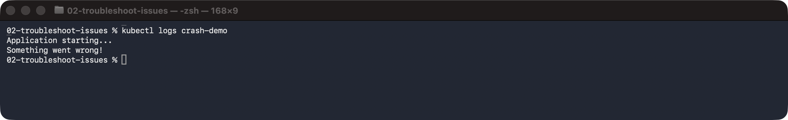

```sh
kubectl describe pod crash-demo
```

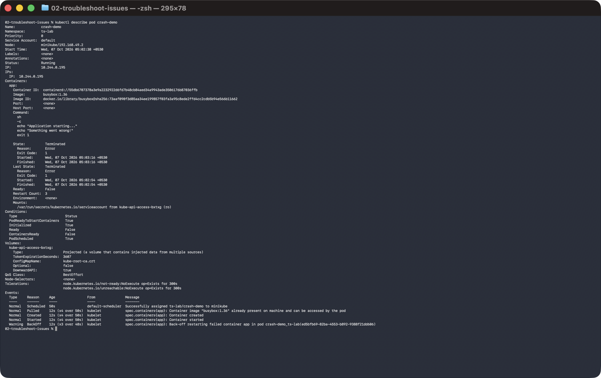

### Root cause

The container's command runs `exit 1`, so the application exits with an error right after starting. Kubernetes restarts it, it fails again, and the restart delay keeps growing — that is `CrashLoopBackOff`.

### Fix

```sh
kubectl delete pod crash-demo
```


```sh
kubectl apply -f crashloop-fixed.yaml
```


### Verify

```sh
kubectl get pod crash-demo
```

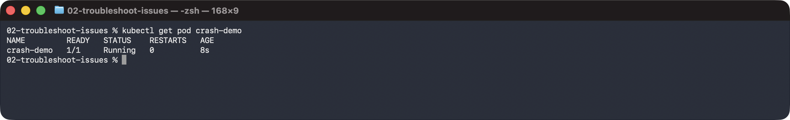

```sh
kubectl logs crash-demo
```

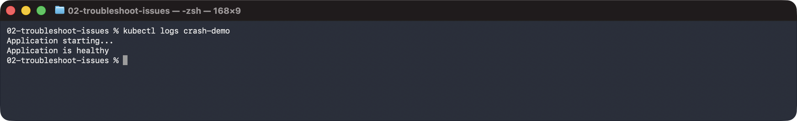

## ErrImagePull

### Identify the problem

```sh
kubectl apply -f image-broken.yaml
```


```sh
kubectl get pod image-demo
```

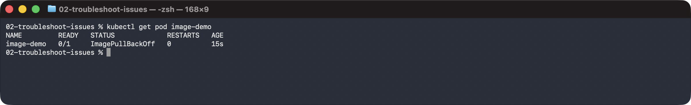

### Investigate

```sh
kubectl describe pod image-demo
```

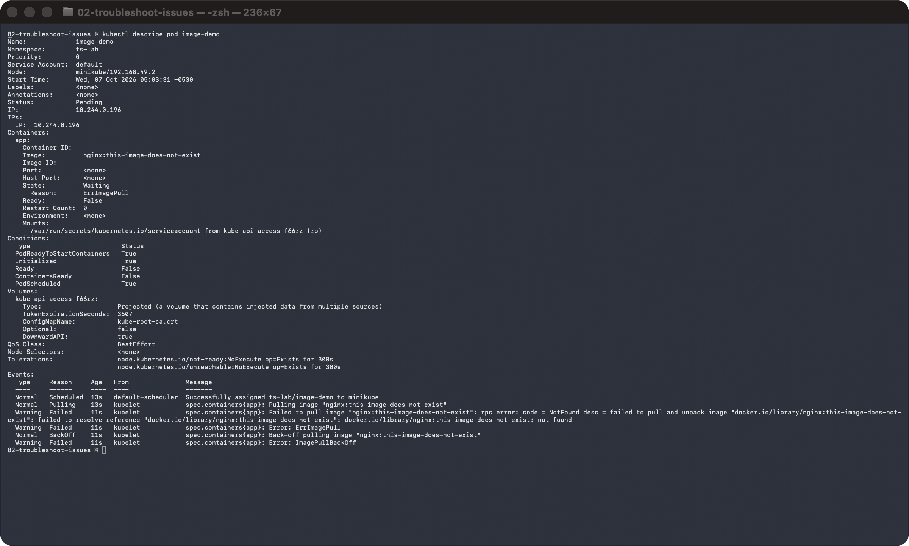

### Root cause

The image tag `nginx:this-image-does-not-exist` does not exist in the registry, so the kubelet cannot pull it (`ErrImagePull`). The fix is shown under ImagePullBackOff below (same Pod, same fix).

## ImagePullBackOff

### Identify the problem

```sh
kubectl get pod image-demo
```

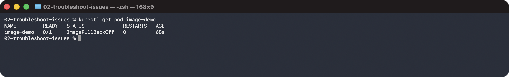

### Investigate

```sh
kubectl describe pod image-demo
```

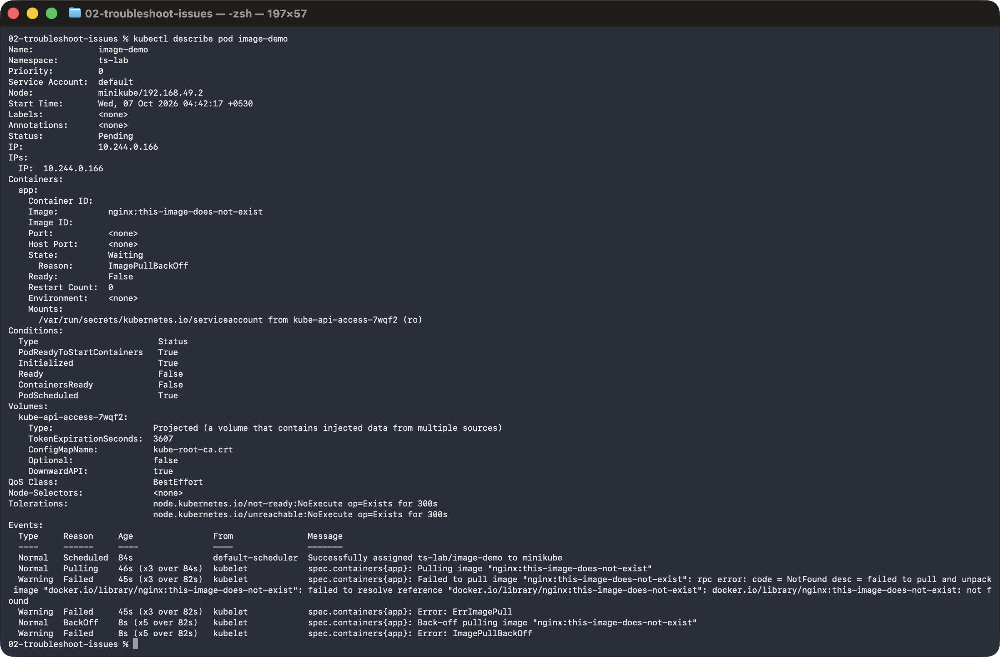

### Root cause

After the first failed pull (`ErrImagePull`), Kubernetes retries with an increasing delay and the status changes to `ImagePullBackOff`. The cause is the same: the image tag does not exist.

### Fix

```sh
kubectl apply -f image-fixed.yaml
```

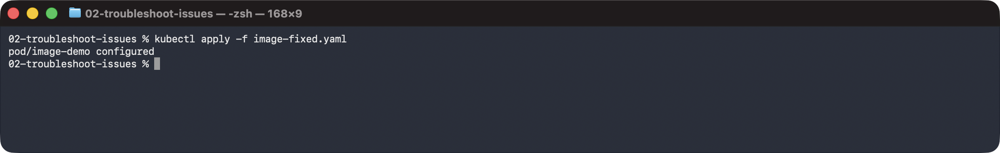

### Verify

```sh
kubectl get pod image-demo
```

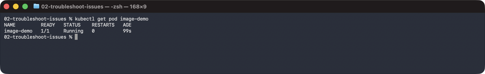

## Pending

### Identify the problem

```sh
kubectl apply -f pending-broken.yaml
```

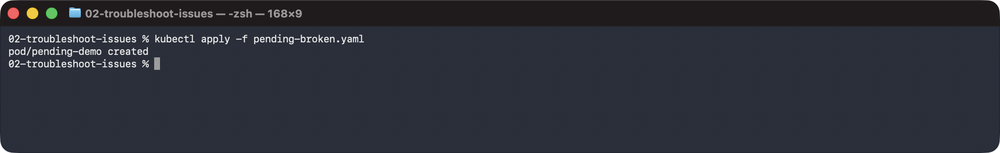

```sh
kubectl get pod pending-demo
```

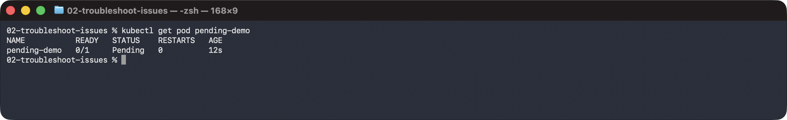

### Investigate

```sh
kubectl describe pod pending-demo
```

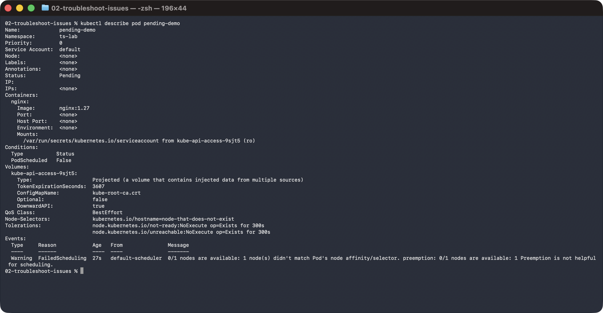

```sh
kubectl get nodes --show-labels
```

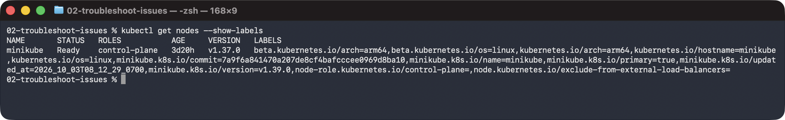

### Root cause

The Pod has `nodeSelector: kubernetes.io/hostname: node-that-does-not-exist`. No node has that label, so the scheduler cannot place the Pod and it stays `Pending`.

### Fix

```sh
kubectl delete pod pending-demo
```

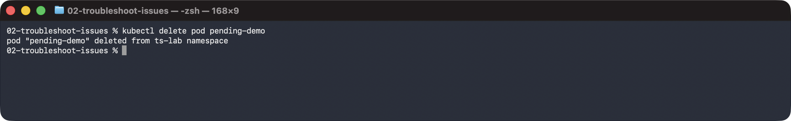

```sh
kubectl apply -f pending-fixed.yaml
```

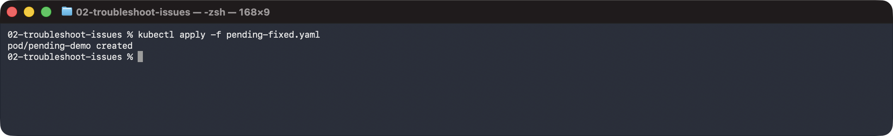

### Verify

```sh
kubectl get pod pending-demo -o wide
```

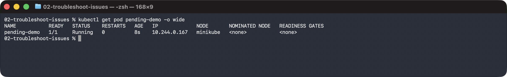

## ContainerCreating

### Identify the problem

```sh
kubectl apply -f containercreating-broken.yaml
```

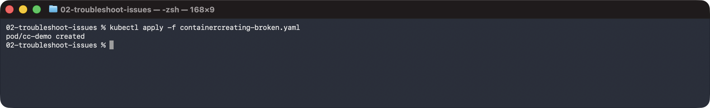

```sh
kubectl get pod cc-demo
```

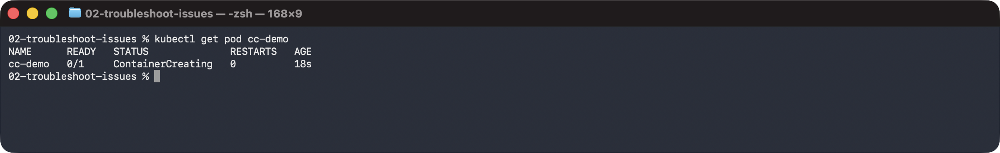

### Investigate

```sh
kubectl describe pod cc-demo
```

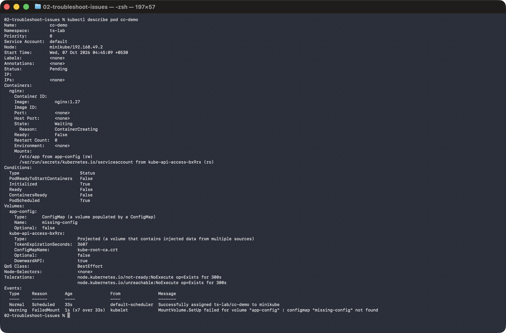

```sh
kubectl get configmap missing-config
```

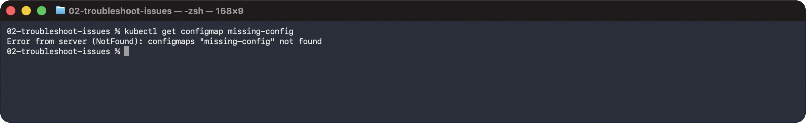

### Root cause

The Pod mounts a volume from the ConfigMap `missing-config`, which does not exist. The kubelet cannot set up the volume, so the container is never started and the Pod stays in `ContainerCreating`.

### Fix

```sh
kubectl apply -f containercreating-fix-configmap.yaml
```

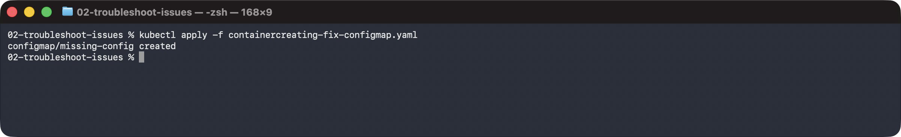

### Verify

```sh
kubectl get pod cc-demo
```

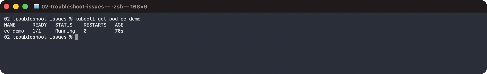

```sh
kubectl exec cc-demo -- cat /etc/app/app.properties
```

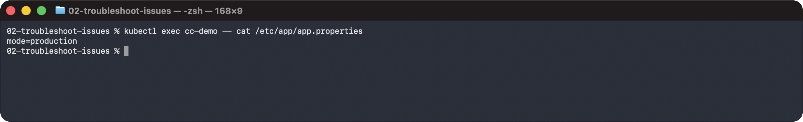

## Service connectivity issue

### Identify the problem

```sh
kubectl apply -f web-deployment.yaml
```

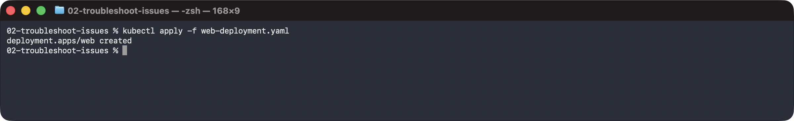

```sh
kubectl apply -f service-broken.yaml
```

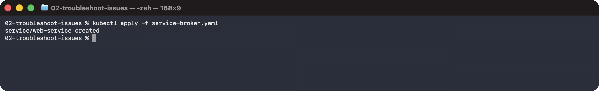

```sh
kubectl run tmp --rm -i --restart=Never --image=busybox:1.36 -- wget -qO- -T 3 http://web-service
```

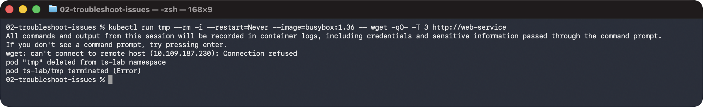

### Investigate

```sh
kubectl get svc web-service
```

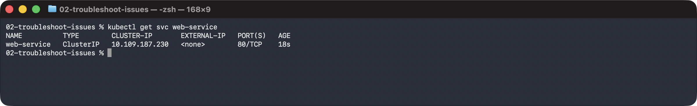

```sh
kubectl get endpoints web-service
```

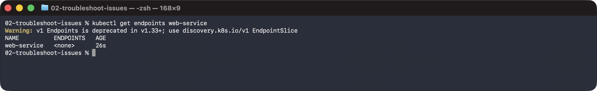

```sh
kubectl describe svc web-service
```

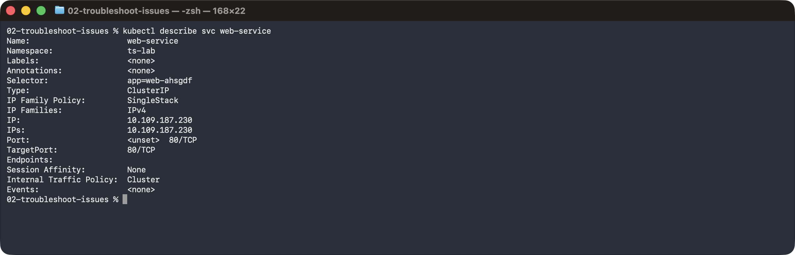

```sh
kubectl get pods --show-labels
```

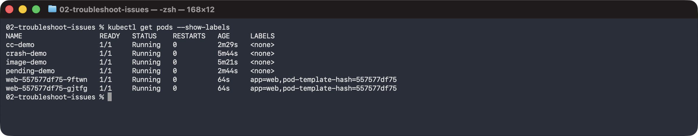

### Root cause

The Service selector is `app: web-ahsgdf`, but the Pods are labelled `app: web`. The selector matches no Pods, so the Service has no endpoints and traffic goes nowhere.

### Fix

```sh
kubectl apply -f service-fixed.yaml
```

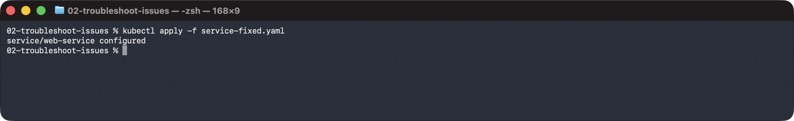

### Verify

```sh
kubectl get endpoints web-service
```

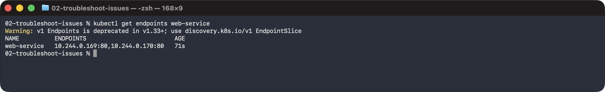

```sh
kubectl run tmp --rm -i --restart=Never --image=busybox:1.36 -- wget -qO- -T 3 http://web-service
```


## DNS issue

### Identify the problem

```sh
kubectl apply -f dns-test-pod.yaml
```

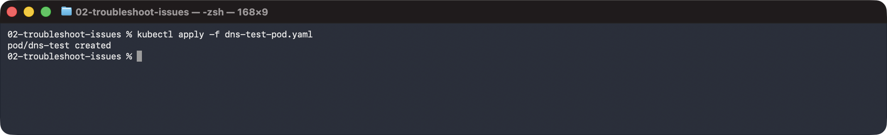

```sh
kubectl apply -f dns-backend.yaml
```

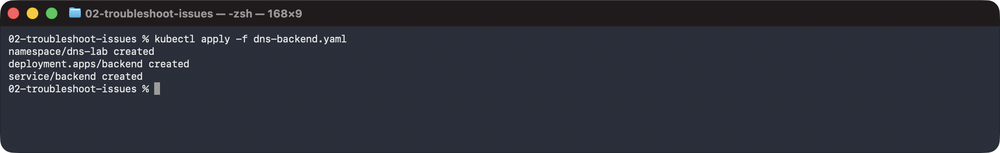

```sh
kubectl exec dns-test -- nslookup backend
```

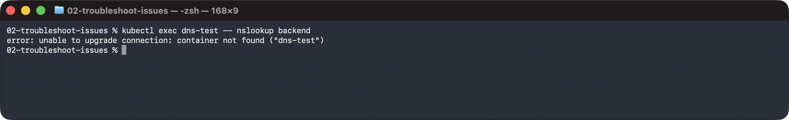

### Investigate

```sh
kubectl get svc -n dns-lab
```

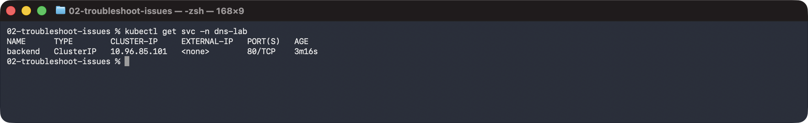

```sh
kubectl exec dns-test -- cat /etc/resolv.conf
```

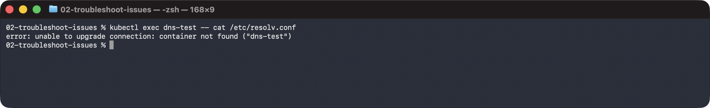

### Root cause

The Service `backend` lives in the namespace `dns-lab`, but the client Pod is in a different namespace. A short name like `backend` only resolves inside the caller's own namespace (the resolver search list contains only the caller's namespace), so the lookup returns NXDOMAIN.

### Fix

```sh
kubectl exec dns-test -- nslookup backend.dns-lab
```

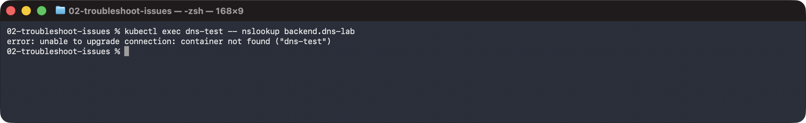

### Verify

```sh
kubectl run tmp --rm -i --restart=Never --image=busybox:1.36 -- wget -qO- -T 3 http://backend.dns-lab
```

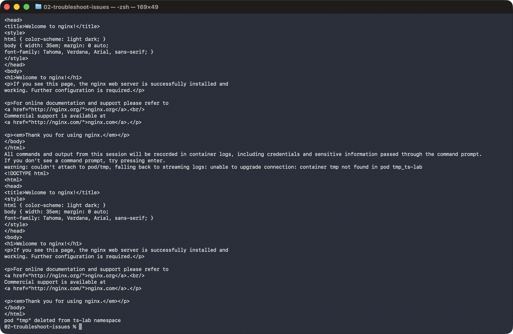

## Pod networking issue

### Identify the problem

```sh
kubectl apply -f netpod.yaml
```

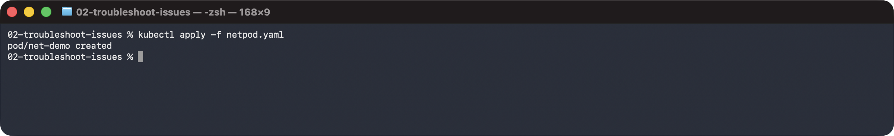

```sh
kubectl get pod net-demo -o wide
```

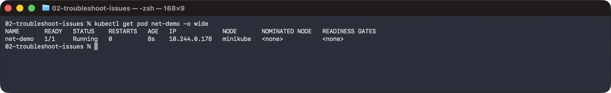

```sh
kubectl run tmp --rm -i --restart=Never --image=busybox:1.36 -- wget -qO- -T 3 http://$(kubectl get pod net-demo -o jsonpath='{.status.podIP}'):80
```

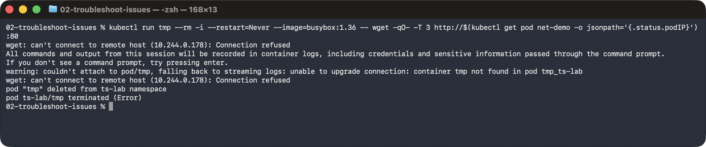

### Investigate

```sh
kubectl exec net-demo -- netstat -ltn
```

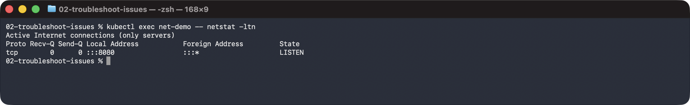

### Root cause

The application listens on port `8080`, but the request was sent to port `80`. Nothing listens on 80, so the connection is refused.

### Fix and Verify

```sh
kubectl run tmp --rm -i --restart=Never --image=busybox:1.36 -- wget -qO- -T 3 http://$(kubectl get pod net-demo -o jsonpath='{.status.podIP}'):8080
```

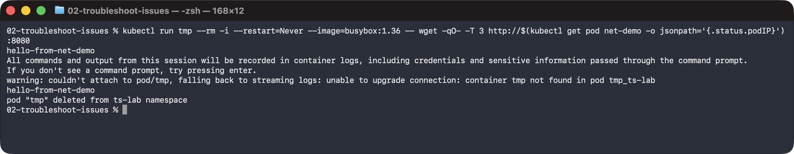

## Configuration issue

### Identify the problem

```sh
kubectl apply -f config-broken.yaml
```

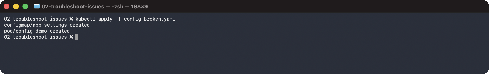

```sh
kubectl get pod config-demo
```

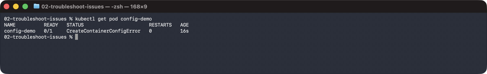

### Investigate

```sh
kubectl describe pod config-demo
```

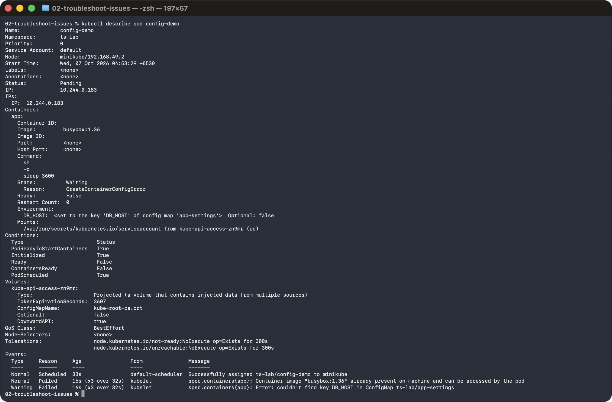

```sh
kubectl describe configmap app-settings
```

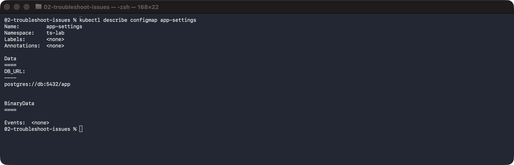

### Root cause

The Pod reads the environment variable `DB_HOST` from the key `DB_HOST` of the ConfigMap `app-settings`, but the ConfigMap only has the key `DB_URL`. The key is missing, so the container cannot be created (`CreateContainerConfigError`).

### Fix

```sh
kubectl delete pod config-demo
```

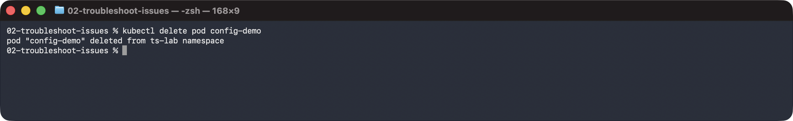

```sh
kubectl apply -f config-fixed.yaml
```

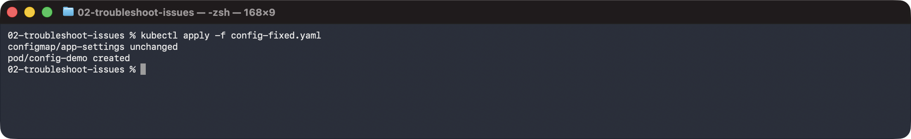

### Verify

```sh
kubectl get pod config-demo
```

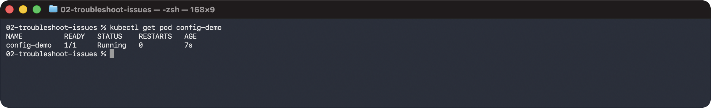

```sh
kubectl exec config-demo -- env | grep DB_
```

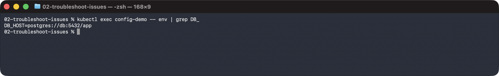
