# Task 3: Kubernetes Troubleshooting Mini Project

## 1. Deploy the application

```sh
kubectl apply -f deployment.yaml
```

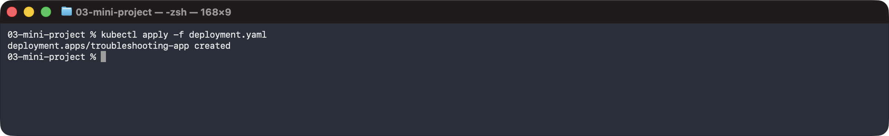

```sh
kubectl apply -f service.yaml
```

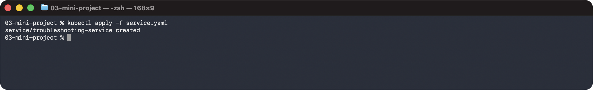

```sh
kubectl get pods
```

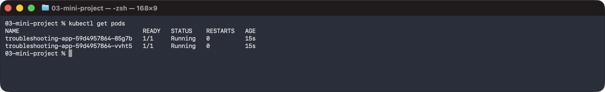

```sh
kubectl get service
```

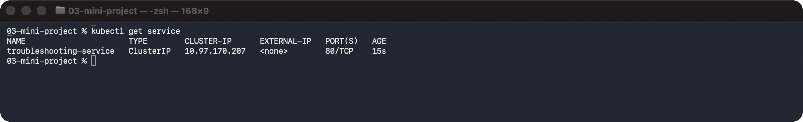

## 2. Check the application

```sh
kubectl get pods -o wide
```

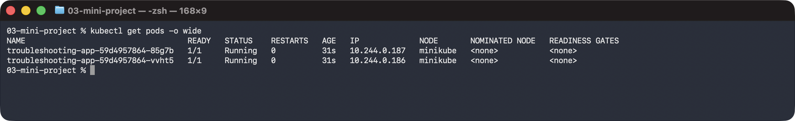

```sh
kubectl describe pod -l app=troubleshooting-app
```

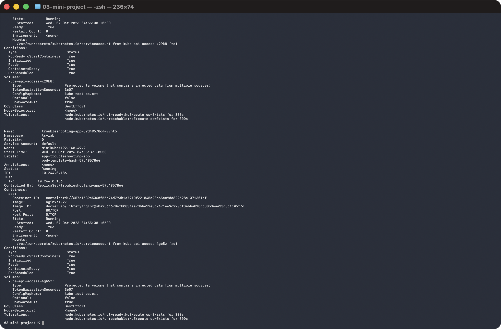

```sh
kubectl logs deploy/troubleshooting-app
```

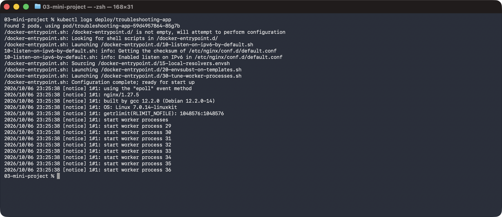

```sh
kubectl exec deploy/troubleshooting-app -- curl -s localhost
```

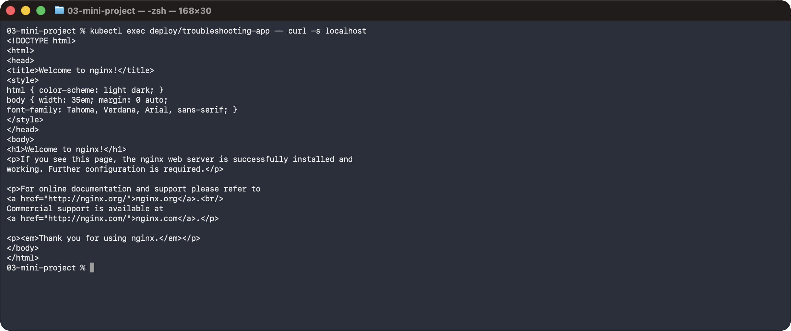

## 3. Check the Service

```sh
kubectl describe service troubleshooting-service
```

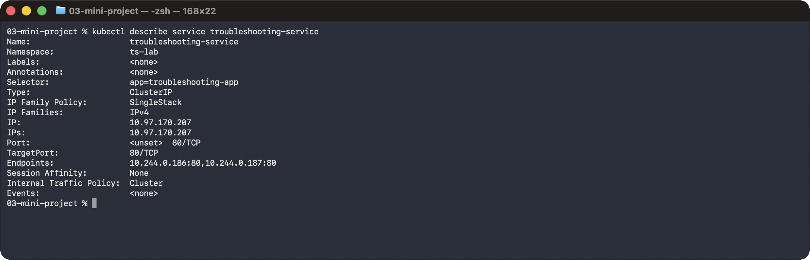

## 4. Check endpoints

```sh
kubectl get endpoints troubleshooting-service
```

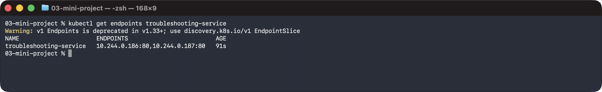

## 5. Create a broken Pod

```sh
kubectl apply -f broken-pod.yaml
```

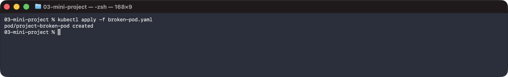

```sh
kubectl get pod project-broken-pod
```

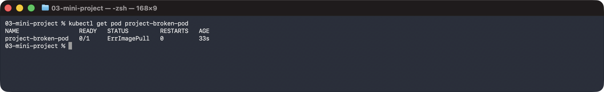

## 6. Troubleshoot it

```sh
kubectl describe pod project-broken-pod
```

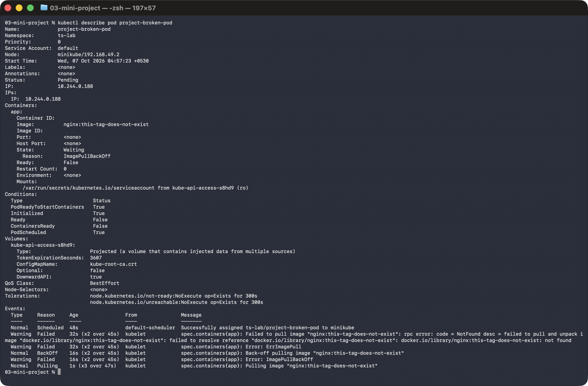

## 7. Answers

**Question 1:** What is the Pod status?  
*Answer:* `ErrImagePull`, which then changes to `ImagePullBackOff`.

**Question 2:** What is the actual error?  
*Answer:* The kubelet cannot pull the image `nginx:this-tag-does-not-exist` — the tag was not found in the registry.

**Question 3:** Which command helped you find the reason?  
*Answer:* `kubectl describe pod project-broken-pod` — the Events section shows the failed pull.

**Question 4:** What is wrong with the image?  
*Answer:* The tag `this-tag-does-not-exist` does not exist for the `nginx` image.

**Question 5:** How would you fix it?  
*Answer:* Use a valid tag, e.g. `kubectl set image pod/project-broken-pod app=nginx:1.27`.

## 8. Service troubleshooting challenge

```sh
kubectl patch service troubleshooting-service -p '{"spec":{"selector":{"app":"wrong-app"}}}'
```

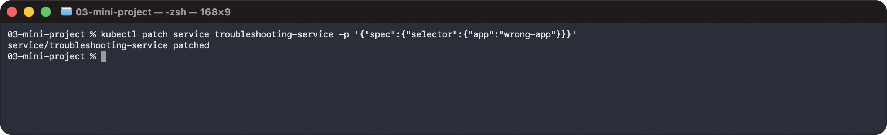

```sh
kubectl get service
```

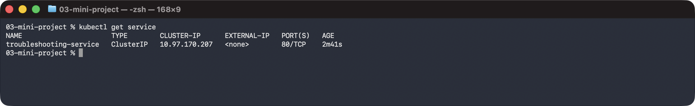

```sh
kubectl get endpoints troubleshooting-service
```

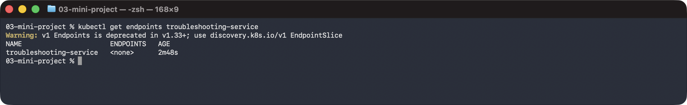

## 9. Find the root cause

```sh
kubectl get pods --show-labels
```

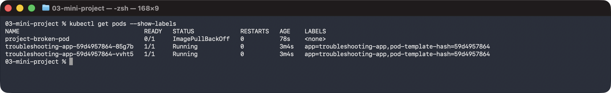

```sh
kubectl describe service troubleshooting-service
```

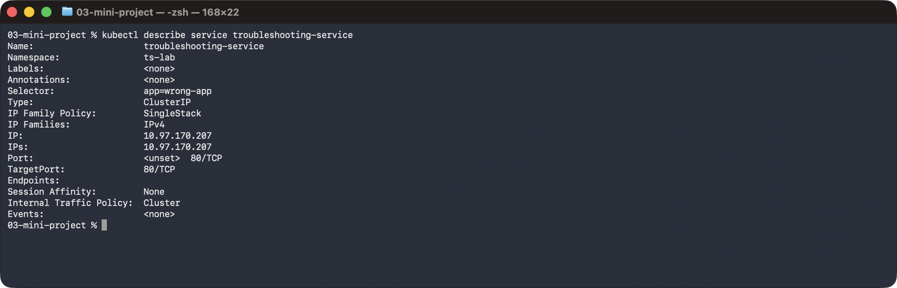

The Pods are labelled `app=troubleshooting-app` but the Service selector is `app=wrong-app`, so no Pods match and the endpoints are `<none>`.

## Fix and verify

```sh
kubectl apply -f service.yaml
```

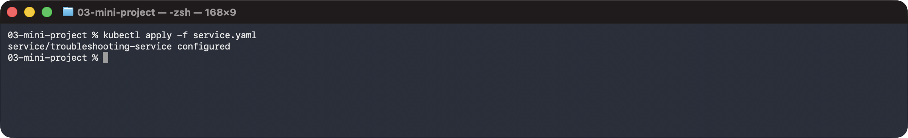

```sh
kubectl get endpoints troubleshooting-service
```

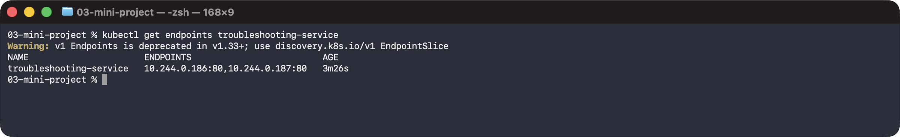

```sh
kubectl run tmp --rm -i --restart=Never --image=busybox:1.36 -- wget -qO- -T 3 http://troubleshooting-service
```

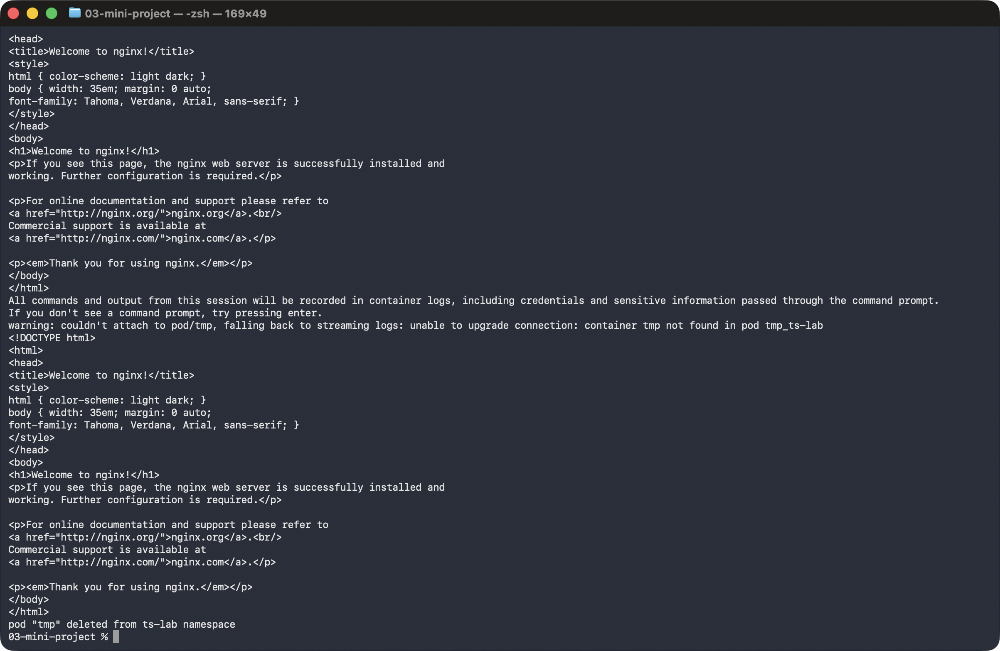

```sh
kubectl set image pod/project-broken-pod app=nginx:1.27
```

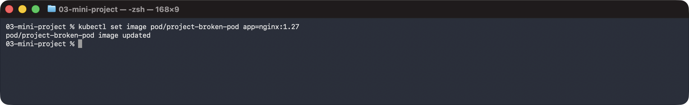

```sh
kubectl get pod project-broken-pod
```

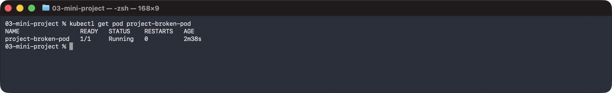

## 10. Final troubleshooting checklist

```sh
kubectl get events --sort-by=.metadata.creationTimestamp
```

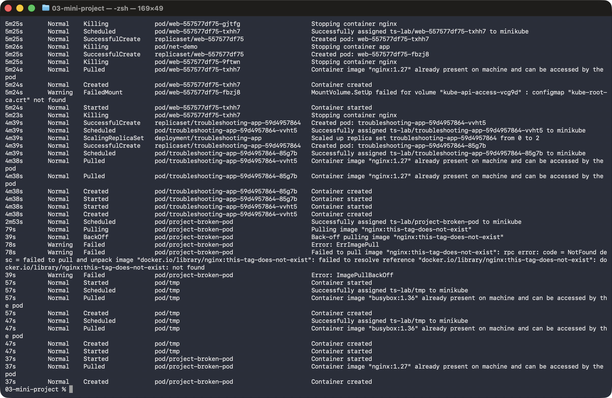

```sh
kubectl run tmp --rm -i --restart=Never --image=busybox:1.36 -- nslookup troubleshooting-service
```

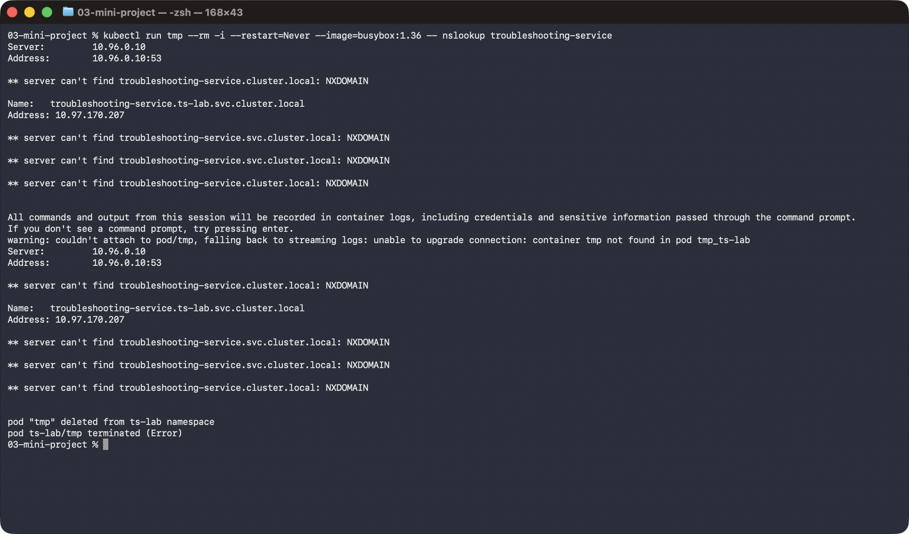

## 11. Troubleshooting table

| Problem | What I Saw | Command I Used | Root Cause | Fix |
| :--- | :--- | :--- | :--- | :--- |
| **Broken Pod** | `project-broken-pod` never became Running (`ErrImagePull` / `ImagePullBackOff`) | `kubectl get pod`, `kubectl describe pod` | Image tag does not exist | `kubectl set image pod/project-broken-pod app=nginx:1.27` |
| **Service Problem** | `get endpoints` showed `<none>` | `kubectl get endpoints`, `kubectl get pods --show-labels`, `kubectl describe service` | Service selector `wrong-app` does not match Pod label `troubleshooting-app` | `kubectl apply -f service.yaml` (selector back to `troubleshooting-app`) |
| **Image Problem** | Events: failed to pull image `nginx:this-tag-does-not-exist` | `kubectl describe pod project-broken-pod` | Non-existent tag | Use a valid tag (`nginx:1.27`) |

## 12. README questions

1. **What does `kubectl get` tell us?** It lists resources (Pods, Services, nodes, ...) with their status, readiness, restarts, age and, with `-o wide`, extra details like IPs and nodes.
2. **Difference between `get` and `describe`?** `get` gives a short summary table; `describe` gives full details of one object, including configuration and the Events that explain what happened.
3. **Why use `kubectl logs`?** To read the output of a container — to see why an application crashed or what it is doing.
4. **When would you use `kubectl exec`?** To run a command inside a running container, for example to test connectivity, inspect files or environment variables.
5. **What does `CrashLoopBackOff` mean?** The container starts, crashes, and is restarted again and again with an increasing delay between restarts.
6. **What does `ImagePullBackOff` mean?** Kubernetes failed to pull the container image and is waiting before retrying (wrong name/tag, missing registry access, ...).
7. **Why can a Pod remain `Pending`?** The scheduler cannot place it: not enough CPU/memory, a `nodeSelector`/affinity that matches no node, taints, or an unbound PersistentVolumeClaim.
8. **Why can a Service have no endpoints?** Its selector matches no ready Pods — a label mismatch, no Pods running, or Pods failing their readiness probe.
9. **Relationship between a Service selector and Pod labels?** The Service sends traffic only to Pods whose labels match its selector exactly; the matching Pods become its endpoints.
10. **What is Kubernetes DNS?** The cluster DNS service (CoreDNS) that gives Services names like `<service>.<namespace>.svc.cluster.local`, so Pods can find each other by name instead of IP.
